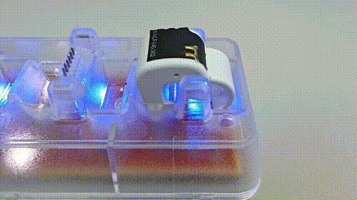
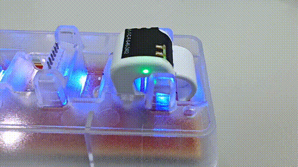
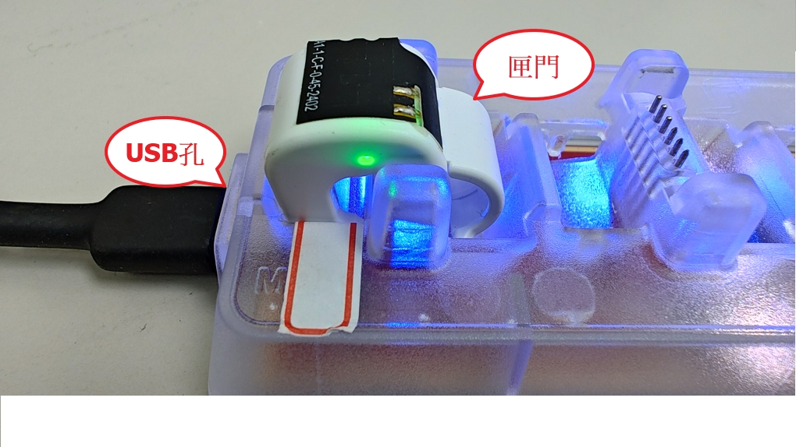
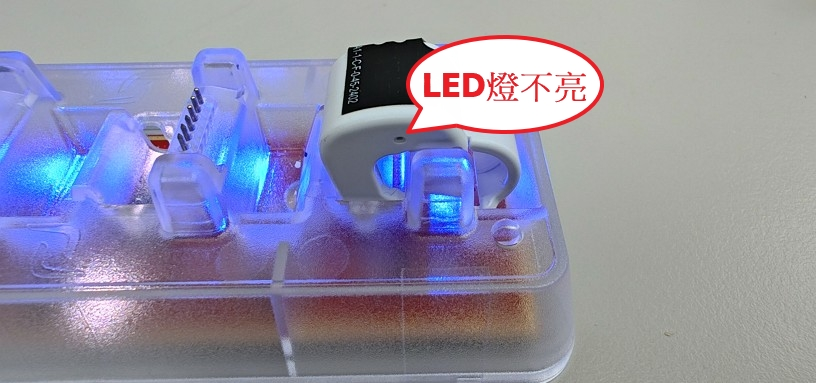

## Mode C 腳環特性

1. Mode C 腳環內建電池，不需要像Mode2、4/4U插拔電池。

2. 傳輸座可用於充電、設定、讀取腳環。

3. 充電時，腳環上LED燈號閃爍表示未充飽電，LED燈號恆亮表示充飽電，設定腳環前將腳環充飽電，否則 Windows AP 在設定時會提示，腳環電量不足。
	- 腳環上LED燈號閃爍表示未充飽電

		
	
	- 腳環上LED燈號恆亮表示充飽電

		

4. 設定放飛 ModeC 腳環，因需要使用 WindowsAP 進行喚醒流程腳環才會甦醒，之後進行設定流程，無法使用類似 Mode 2、Mode4/4U 裝上電池馬上開始記錄軌跡。

   

## Mode C傳輸座相關

1. 使用Type C傳輸線，可接電腦或手機充電頭充電。

2. 最多一次可放置 4 顆腳環同時設定或讀取。

3. 驅動程式在 Windows 10/11，連接傳輸座後，會自動下載和安裝，如未自動安裝，需要手動安裝驅動。

4. 將腳環放置傳輸座有方向性，放置時腳環匣門與傳輸座 USB 孔反方向，放置時需稍微往下壓，使腳環固定在傳輸座上。

	

5. 腳環放置傳輸座需觀察腳環上LED燈是否閃爍或恆亮，如LED不亮，可能是未放置成功，需要重新放置，腳環未放置成功，設定或讀取時 Windows AP 會提示未偵測到腳環。

	

6. 設定或讀取時，傳輸座燈號會有紅色與綠色燈號閃爍，表示正在進行設定或讀取流程，如設定或讀取過程中，紅色燈不亮，可能是腳環喚醒失敗，待 WindowsAP 提示後，將腳環換一個傳輸座 port，重新設定或讀取。

	<video width="480" height="320" controls>
    <source src="images/ModeC_dock-video-3.mp4" type="video/mp4">
	</video>