# skyleader3.0正式版

# 目錄

## 1. [基礎功能](#基礎功能)

### 🔹[註冊帳號](#註冊帳號)

##### 🔸[傳輸座驅動安裝](#傳輸座驅動安裝)

##### 🔸[忘記密碼重設](#忘記密碼重設)

### 🔹[網頁指南](#網頁指南)

### 🔹[用戶資訊](#用戶資訊)

##### 🔸[會員資料](#會員資料)

##### 🔸[我的帳戶](#我的帳戶)

##### 🔸[偏好設定](#偏好設定)

### 🔹[社交功能](#社交功能)

##### 🔸[首頁](#首頁)

##### 🔸[活動](#活動)

##### 🔸[軌跡](#軌跡)

### 🔹[查詢](#查詢)

## 2. [活動](#活動)

### 🔹[新增活動](#新增活動)

##### 🔸[活動建立](#活動建立)

##### 🔸[街景觀看](#街景觀看)

##### 🔸[放飛時間、國家、活動說明](#放飛時間國家活動說明)

##### 🔸[距離單位更換](#距離單位更換)

##### 🔸[活動設定是否公開、軌跡證書生成](#活動設定是否公開軌跡證書生成)

##### 🔸[私人記事](#私人記事)

##### 🔸[確認活動資訊是否正確](#確認活動資訊是否正確)

##### 🔸[編輯活動](#編輯活動)

##### 🔸[刪除活動](#刪除活動)

##### 🔸[分享活動](#分享活動)

### 🔹[應用程式](#應用程式)

##### 🔸[操作流程圖](#操作流程圖)

##### 🔸[下載程式](#下載程式)

##### 🔸[變更語言](#變更語言)

##### 🔸[設定放飛](#設定放飛)

##### 🔸[匯入會員資料](#匯入會員資料)

##### 🔸[綁定GPS](#綁定GPS)

##### 🔸[讀取GPS](#讀取GPS)

### 🔹[活動內容](#活動內容)

##### 🔸[內容位置](#內容位置)

##### 🔸[活動照片](#活動照片)

##### 🔸[設定](#設定)

##### 🔸[綁定](#綁定)

##### 🔸[讀取](#讀取)

##### 🔸[篩選](#篩選)

##### 🔸[軌跡證書](#軌跡證書)

##### 🔸[下載軌跡證書](#下載軌跡證書)

## 3. [商店](#商店)

## 4. [官方網站](#官方網站)

## 5. [關於我們](#關於我們)

---

# 基礎功能

## 註冊帳號

### 請先至👉 [skyleader3.0網頁](https://sport.skyleader.com.tw/Home/login)登入頁面，再點擊頁面中間的``建立帳號``，進行帳號註冊。

### 請選擇使用``電子信箱``或``手機號碼``進行註冊。

### 填寫完電子信箱/手機號碼及密碼後，請您打勾``☑註冊前，請您同意服務及隱私政策``欄位，再點擊註冊按鈕。

### ⭐️請至您的電子信箱/手機號碼收取驗證碼，並完成驗證，驗證完成即可登入至首頁。

#### [返回目錄](#目錄)

## 傳輸座驅動安裝

### 請先至👉 [skyleader.tw檔案下載](https://www.skyleader.tw/%E6%AA%94%E6%A1%88%E4%B8%8B%E8%BC%89/)頁面中。

### 選擇您使用的電腦作業系統，點擊圖示，即可下載傳輸座驅動程式。

### 於下載資料夾中找到剛剛下載的傳輸座驅動壓縮檔。

### 滑鼠點擊壓縮檔一下，再按下滑鼠右鍵，點選功能視窗中的圖示，解壓縮檔案。

### 找到剛剛解壓縮的檔案，點擊兩下，再點擊下方的檔案。

### 點擊有著圖示的檔案，開始安裝傳輸座驅動程式。

### 開啟驅動程式後，點擊Next按鈕。

``

### 完成安裝後，您會看到下方圖示所示的畫面，點擊Finish按鈕，即可完成安裝傳輸座驅動的所有步驟。

``

#### [返回目錄](#目錄)

## 忘記密碼重設

### 請先至👉 [skyleader3.0網頁](https://sport.skyleader.com.tw/Home/login)登入頁面，點擊密碼欄位右下方的``忘記密碼``，進行密碼重設。

``

### 您可以選擇輸入``電子信箱/手機號碼``的方式重設密碼。

### 密碼重設的簡訊會依據您給的``電子信箱/手機號碼``進行發送，點擊``送出``按鈕即可發訊。

### ⭐️ 如想使用``手機號碼``重設密碼，請點擊``送出``按鈕上方的``切換至手機號碼``即可切換。

``

### ``切換至手機號碼``後的畫面如下圖所示。

``

#### [返回目錄](#目錄)

## 網頁導覽

### Skyleader3上方為[首頁](#首頁)、[活動](#活動)、[商店](#商店)、[官方網站](#官方網站)、[關於我們](#關於我們)，可點擊切換至您所需的頁面。

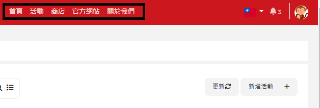

#### [返回目錄](#目錄)

## 用戶資訊

## 會員資料

### 畫面右上角點選自己的頭貼，可變更``會員資料``或``登出``帳號。

``

### 點擊``會員資料``會進入到會員資料的頁面，即可變更會員資料。

``

#### [返回目錄](#目錄)

## 我的帳戶

### 點擊``我的帳戶``可觀看``會員成立時間``及``登入資訊變更``。

``

#### [返回目錄](#目錄)

## 偏好設定

### 點擊``顯示偏好設定``可設定距離的單位。

#### [返回目錄](#目錄)

## 社交功能

## 首頁

### 點擊首頁中的``熱門軌跡``，可看見現在熱門中的軌跡資訊，軌跡資訊的下方有``關注、按讚、留言及分享``的功能，提供您做使用。

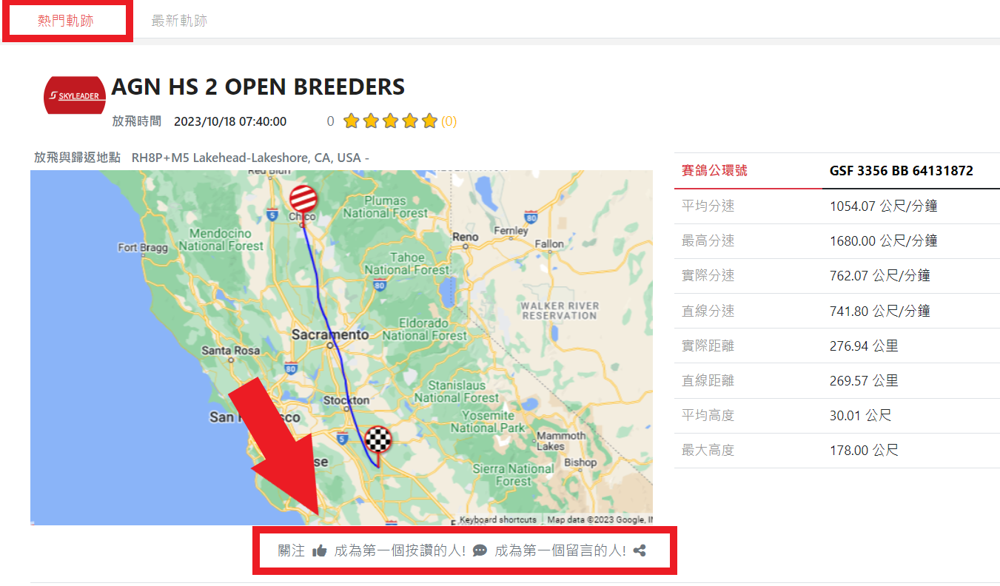

### 點擊留言圖示，下方將顯示出讓您填寫留言的區塊，給予⭐️數和填寫完畢後，請點擊``張貼``按鈕，即可上傳留言。

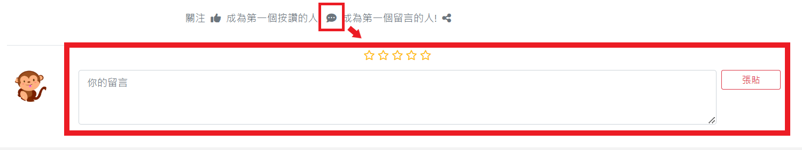

### 當您點擊及旁的文字時，會跳出一個小視窗，您可以依您的喜好做選擇。

### ⭐️按讚的小視窗。

`</img>`

### ⭐️留言的小視窗。

`</img>`

#### [返回目錄](#目錄)

## 活動

### 開啟您要查看的``活動``，您會看見活動的右上方有``關注、按讚、留言及分享``的功能，提供您做使用。

### ⭐️需要在讀取的畫面上才能操作。

### 點擊留言圖示，頁面會移至下方，並顯示出讓您填寫留言的區塊，給予⭐️數和填寫完畢後，請點擊``張貼``按鈕，即可上傳留言。

### 當您點擊及旁的文字時，會跳出一個小視窗，您可以依您的喜好做選擇。

### ⭐️按讚的小視窗。

`</img>`

### ⭐️留言的小視窗。

`</img>`

#### [返回目錄](#目錄)

## 軌跡

### 開啟您要查看的``軌跡``，頁面會移至下方，您會看見軌跡的名稱出現在活動名稱右側，而正下方有``關注、按讚、留言及分享``的功能，提供您做使用。

### 您可以於下方區域中填寫留言，給予⭐️數和填寫完畢後，請點擊``張貼``按鈕，即可上傳留言。

### 當您點擊及旁的文字時，會跳出一個小視窗，您可以依您的喜好做選擇。

### ⭐️按讚的小視窗。

`</img>`

### ⭐️留言的小視窗。

`</img>`

#### [返回目錄](#目錄)

## 查詢

## 首頁

### Skyleader3左上角為``活動``的搜尋，可搜尋到別人及自己的活動。

#### [返回目錄](#目錄)

## 活動

### 點擊進入``活動頁面``後，在畫面中上方有一個搜尋欄位，可以讓您查訊自己的活動。

#### [返回目錄](#目錄)

---

# 活動

## 新增活動

## 活動建立

### 登入後，點左上角``新增活動``。

### 也可於活動頁面中右側的``新增活動``。

### 新增活動前，必須注意每個欄位旁是否有`` * (必填欄)`` ，若有出現" `` *`` "必須填寫完才有辦法新增比賽。

### 輸入您的活動名稱。

### 點選活動類型``比賽``，再點選紀錄模式選擇``您所需的模式``。

### ⭐️12HR為一般常用設定值

### ``放飛地點``與``歸返地點``設定。

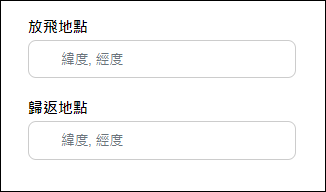

### 由下方地圖去設定

### 往下滑至地圖，按一下``設定地點``，按下去會變成``停止設定``的文字，這樣才代表有點擊成功。

### 點擊完``設定地點``後，即可在地圖上設置放飛地點及歸返地點。

### 若想變更地點，直接按住地圖裡的``起點(放飛地點)``或``終點(歸返地點)``的大頭圖標做拖曳至想變更的位置，即可完成地點變更。

### ⭐️點第一下設定``放飛地點``，點擊第二下設定``歸返地點``。

### 也可點擊右鍵選擇要設置放飛或歸返地點。

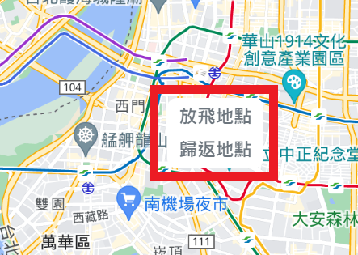

### 您可以參考地圖左上有地圖、衛星檢視、街景觀看來尋找放飛及歸返的地點。

### ⭐️地圖:地圖形對比圖。

### ⭐️衛星檢視:地名對比圖。

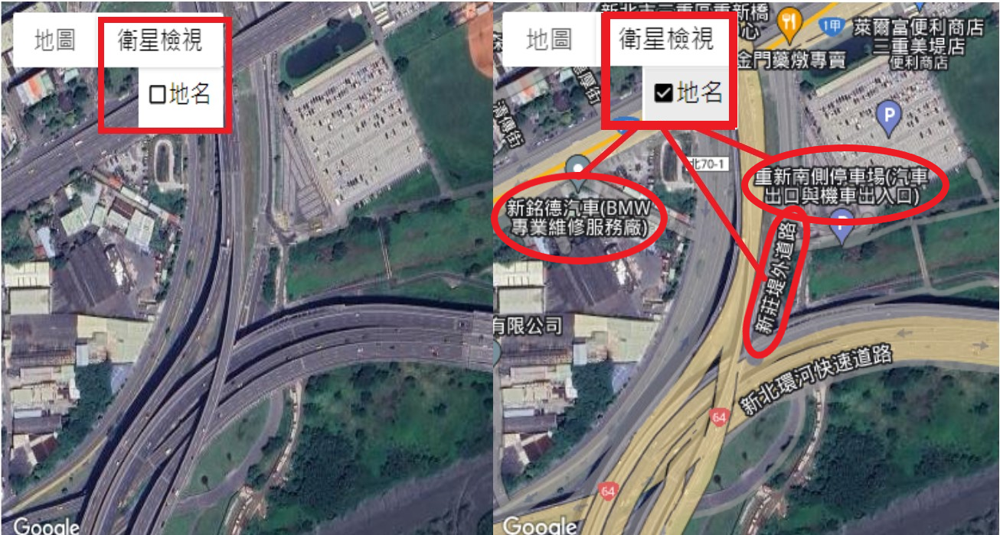

## 街景觀看

### 請先尋找地圖裡的``小黃人``，將小黃人按住拖曳至你想觀看的地方放開。

### ⭐️呈現``水藍色``的道路才可觀看，觀看完按``ESC``鍵即可退回原地圖。

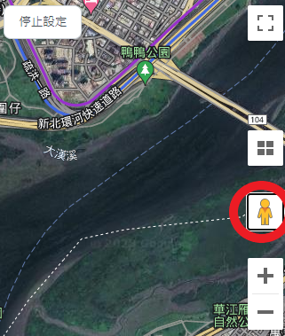

## 放飛時間、國家、活動說明

### 設定``放飛時間``、``放飛國家  ``，活動說明為``非必要``填寫欄位，可依您的需求填寫註記。

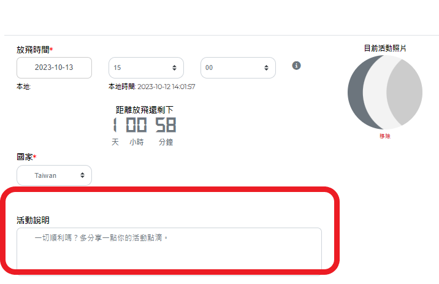

#### [返回目錄](#目錄)

## 距離單位更換

### 系統將會以``放飛地點``及``歸返地點``計算出距離，可選擇單位。

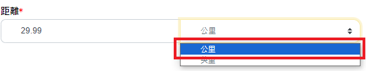

#### [返回目錄](#目錄)

## 活動設定是否公開、軌跡證書生成

### 可依您的需求選擇是否公開此次活動內容

### ⭐️若有要分享給其他人，請記得設``公開``。

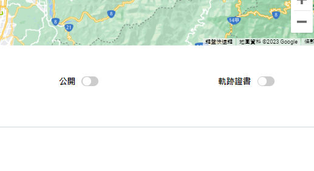

### 點擊公開後的圖示會呈現``深灰色``，白色按鈕會跑至右邊。

### 請參考下圖 👇

#### [返回目錄](#目錄)

## 私人記事

### 為``非必填``欄位，本帳號才看得到。

### 按``新增活動``，完成活動創辦

### 確認活動資訊是否正確

### 新增活動完會自動跳入至我的活動，``左鍵點擊一下``剛創辦的比賽，活動說明就會出現，確認活動資訊是否正確。

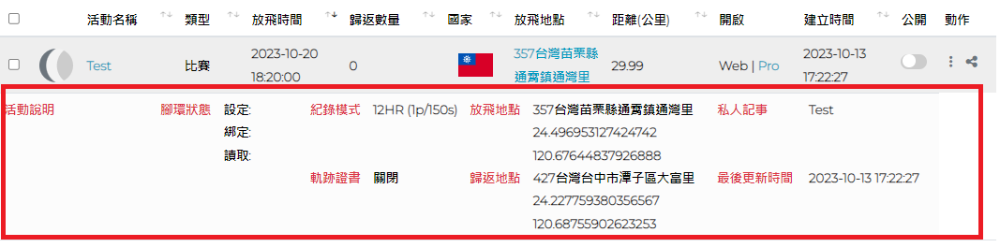

## 編輯活動

### 在您的活動清單右側紅圈處(圖示為三個點)，點擊``編輯``進入編輯頁面。

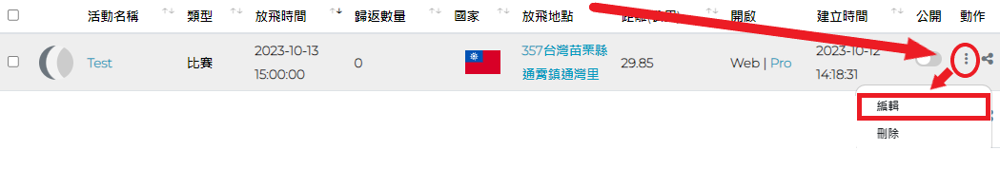

### 您也可以點入活動中，點選``圖示，進入編輯頁面。

``

### 下圖為編輯活動頁面範例。

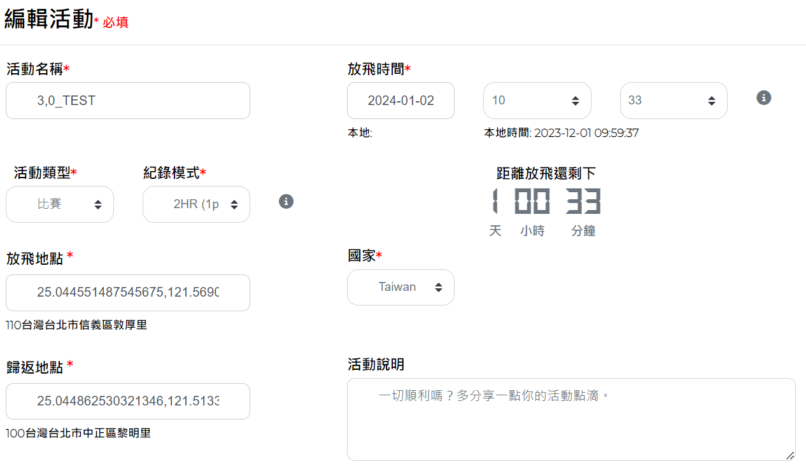

### ⭐️ 當放飛時間已經到時，將會限制修改部分資訊。

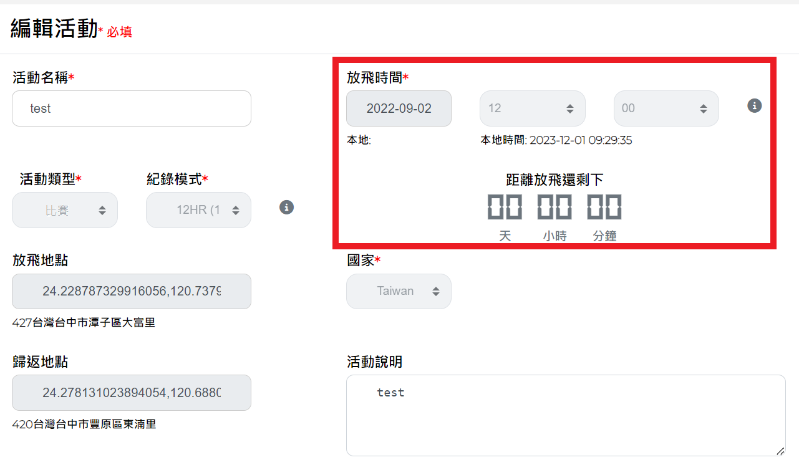

#### [返回目錄](#目錄)

## 刪除活動

### 在您的活動清單右側紅圈處(圖示為三個點)，點擊刪除即可刪除該活動。

### ``⭐️請注意，刪除活動後，將無法還原。``

### 如果您需要``刪除多個活動``可勾選左側旁的`</img>`，並點擊上方顯示動作的欄位，點擊裡面的刪除即可刪除多個活動。

``

#### [返回目錄](#目錄)

## 分享活動

### 活動可分享給其他人，觀看者必須是會員才有辦法觀看。

### ``⭐️請將活動先設為公開才能分享。``

``

#### [返回目錄](#目錄)

## 應用程式

## 操作流程圖

</img>

#### [返回目錄](#目錄)

## 下載程式

### 請至我的活動中，點擊Pro進入下載軟體程序。

### ⭐️在使用軟體之前，請確認是否已新增活動。

### ⭐️設定腳環前，需先下載應用程式。

### 點擊完Pro後，請至``「下載」``尋找skyleader3壓縮檔，完成skyleader3資料夾解壓縮。

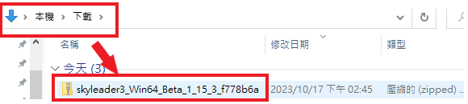

### 完成解壓縮後，點進skyleader3資料夾裡。

### 滑鼠左鍵快速點擊兩次🐦skyleader3的應用程式，開啟使用者介面。

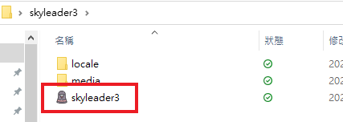

### 登入畫面如圖所示，請輸入您的 ``ACCOUNT:帳號``及 ``PASSWORD:密碼``，登入帳密與skyleader3網頁相同。

``

#### [返回目錄](#目錄)

## 變更語言

### 進入畫面後您會看到介面預設語言為您的系統預設語言，如無須調整請直接跳到👉[設定放飛](#設定放飛)的操作說明。

``

### 請將滑鼠移動到程式``左上方的Skyleader``字樣上，點擊後會跳出一個選單，點選``Language:語言``，再點選選單內的``Tradition Chinese:繁體中文``。

``

### 點選完成後會跳出一個小視窗，如下圖所示。

### 點選小視窗上的OK按鍵，並重開程式即可完成語言的變更。

``

### 下圖為變化語言後的介面。

#### [返回目錄](#目錄)

## 設定放飛

### 接下來將使用繁體中文介面做設定放飛的步驟說明。

### 進入介面後點擊``最左邊的圖示``，並確認紅色按鈕的文字是否顯示``「設定放飛」``，確認無誤即可進行下一步。

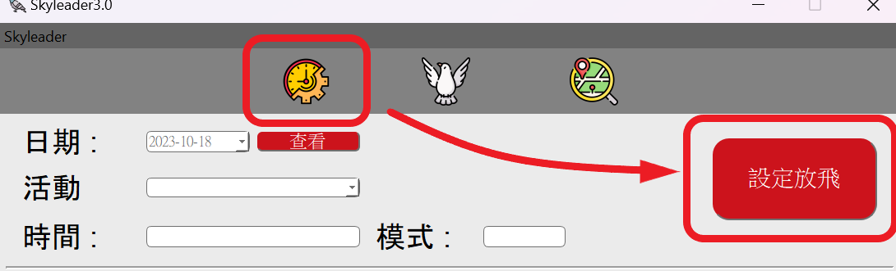

### 請檢查您的傳輸座否有正常運作。

### 開始設定放飛時，請先點擊日期欄位旁的``按鍵(1)``，點選您在網頁上設定放飛的``日期(2)``，最後在點擊``「查看(3)」``，完成日期的選擇。

### 如果``「查看」``沒有設定放飛的日期，會如下圖所示的畫面，跳出一個提示視窗，告訴您該日無放飛設定。

### 下圖為讀取到活動後會呈現的畫面，請您檢查``活動、時間及模式``是否正確。

### 假設當天有超過一場活動，可點擊活動旁的按鈕，然後選擇要設定的活動。

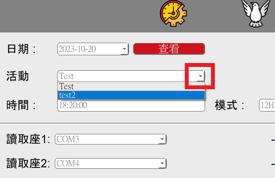

### 將腳環設置於傳輸座後點擊畫面右邊的``「設定放飛」``按鈕，點擊後按鈕顏色會呈現灰色，代表點擊成功並開始寫入設定。

### 傳輸座欄位右邊會顯示腳環ID及設定的狀態。

### ⭐️當出現``Success(成功)``代表成功設定。

### ⭐️當出現``Fail(失敗)``代表設定失敗，請重新將腳環放置傳輸座。

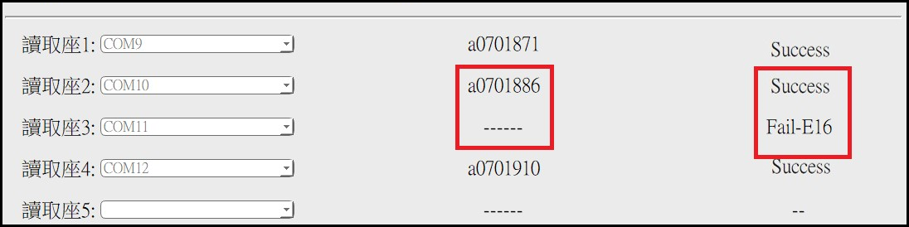

### 完成設定後您可以回到👉 [skyleader3.0網頁](https://sport.skyleader.com.tw/Home/login)上，查看設定的腳環。

#### [返回目錄](#目錄)

## 匯入會員資料

### ⭐️若您要用電子環掃描的方式綁定腳環，綁定前要先匯入會員資料，請您前往您所要綁定腳環的活動頁面中。

### 請點擊``匯入會員資料``。

### 請先下載``樣板``，打開樣板填寫資料。

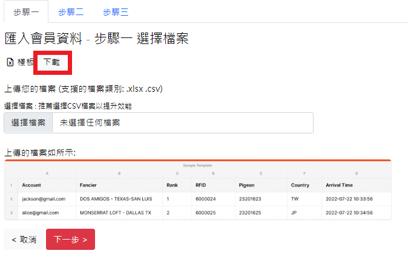

### 打開檔案後，您會看到以下的格式，請依照下方的說明填入資料。

### 選擇檔案，點擊剛填好的樣板檔案。

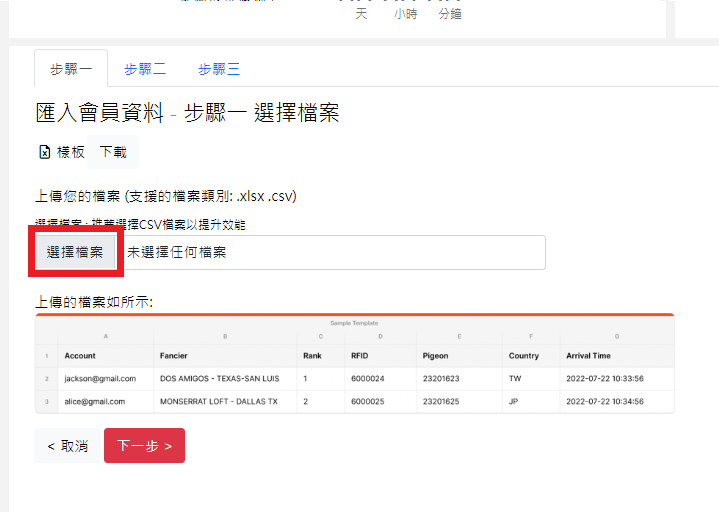

### 點選下一步。

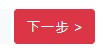

### 您會在步驟二中看見剛剛匯入的資料。

### 確認資料無誤後，點擊``匯入會員資料``，會在上方跳出小視窗詢問是否要匯入，點擊確定完成匯入。

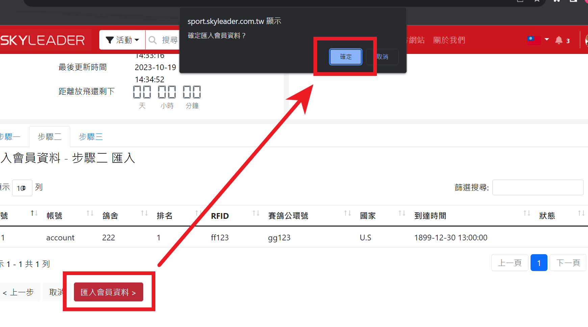

### 進入步驟三後您可以看到匯入資料的狀況，點擊``匯入完成``，完成匯入會員資料的所有程序。

## 綁定GPS

### 在綁定前請先關閉應用程式，並連接上您的Rfid感應器，完成後再開啟程式以便程式偵測到您的感應器。

### ⭐️``請不要在ComPort上連接Rfid感應器以外的裝置。``

### 請於``設定放飛``的畫面上，將滑鼠移動到程式``左上方的Skyleader``字樣上，點擊後會跳出一個選單，點選``Rfid``，會跳出電子環感應器的設定介面。

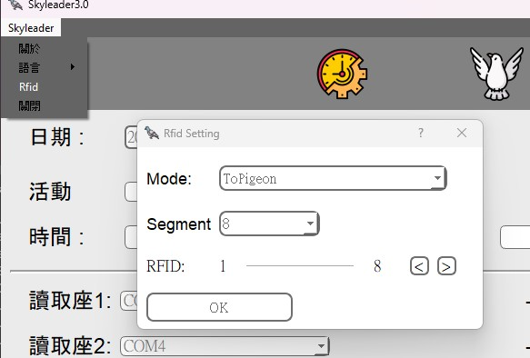

### 點選``Mode(模式)``欄位，您可選擇對應自己感應器的廠牌。

### ⭐️ToPigeon: 鴿神一號

### ⭐️AnJie: 安捷

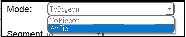

### 完成Mode點選後，可點選``Segment(長度)``，調整成您的電子環ID比對區段。

### 點擊``Rfid``旁的按鈕，可調整要截取的號碼間段。

### 假設我的電子環ID長度要8，但號碼為AB23334441，我只需要數字的比對區段，就要設定於3-10之間。

### 點擊按鈕後的示意圖

### 完成Rfid設定後，點擊``中間的鴿子圖示```</img>`，進入綁定功能的介面。

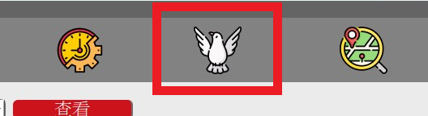

### 綁定介面的示意圖

``

### 在``綁定``介面中是無法調整Rfid設定的，如需調整請再回到``設定放飛``的介面調整。

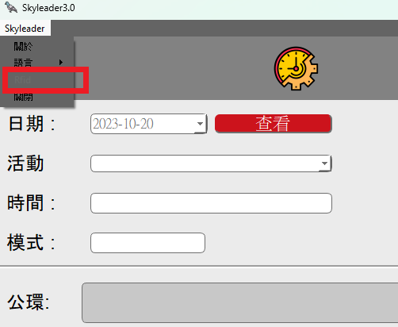

### 請先載入要綁定的活動，然後即可點開綁定按鈕右邊的``RFID Reader``。

``

### 點開後可以查看Reader欄位中的號碼是否與您的感應器相同，確認無誤後請點擊``Binding Table``回到原先的畫面。

``

### 滑鼠點擊``公環``旁的白色欄位，開始掃描電子環。

``

### 掃描完下方的``GPS ID``旁的白色欄位會開啟，緊接著掃描GPS腳環上的QRcode或手動輸入。

### ⭐️掃描完QRcode系統會自動匯入綁定資料。

### ⭐️手動輸入需在點擊下方的紅色``綁定``按鈕或點擊鍵盤上的Enter鍵，完成一次綁定。

``

### 介面右方的``Binding Table``表格中，會顯示您綁定的資料、筆數及時間，您可以透過這個表格確認資料是否正確。

### 如果有綁定錯誤的狀況，可以在``公環``欄位上輸入要解除綁定的ID，在按下Enter鍵後會跳出一個小視窗詢問您，是否要重新綁定，點擊yes即可重新綁定。

### 也可以透過先輸入公環號再點擊下方的``PASS``，先將公環資料紀錄於活動中，方便您之後要尋找要綁定的公環號。

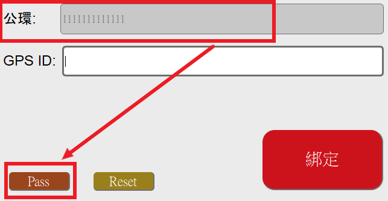

### 點擊``PASS``匯入成功時會跳出的視窗。

### 當該GPS環並未設定放飛時，會跳出一個小視窗告訴您此狀況。

### 當您再匯入資料前發現有誤時，可以點擊``Reset``按鈕，會清除``公環欄位及GPS ID欄位``上的資料。

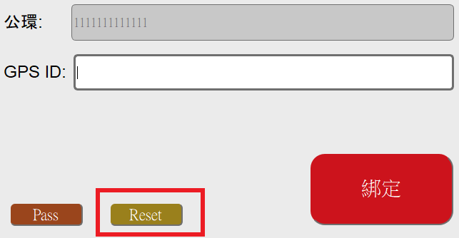

### 完成綁定後您可以回到👉 [skyleader3.0網頁](https://sport.skyleader.com.tw/Home/login)上，查看綁定的腳環及公環。

#### [返回目錄](#目錄)

## 讀取GPS

### 點擊``左邊的放大鏡圖示``，進入讀取功能的介面。

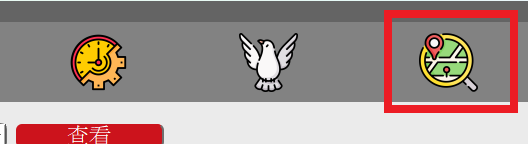

### ``讀取``介面的使用方式與``設定放飛``一樣，如想返回去看可點擊這裡👉[設定放飛](#設定放飛)返回觀看。

### ⭐️請確定點擊完圖示後，右邊的按鈕是否為紅色``讀取``按鈕。

### ⭐️``若要讀取腳環時，忘記到"讀取"介面，按成設定放飛，原要讀取的軌跡、資料則會被清除。``

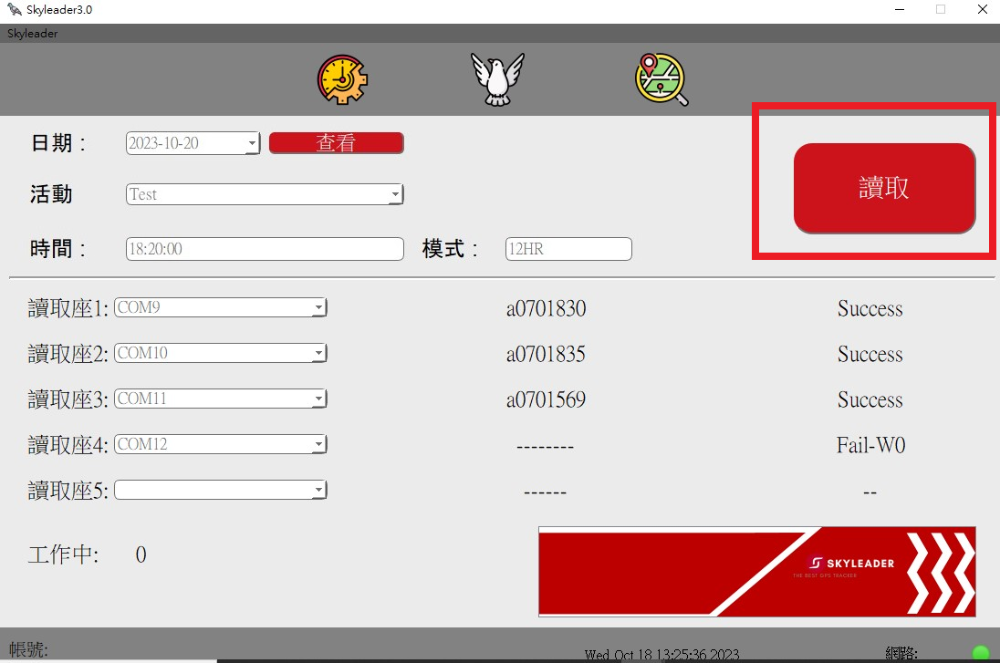

### 完成讀取後請您回到👉 [skyleader3.0網頁](https://sport.skyleader.com.tw/Home/login)上，進行查看軌跡的程序。

``
``

#### [返回目錄](#目錄)

## 活動內容

## 內容位置

### 設定腳環後，可至我的活動，點選(自己建立的活動名稱)。

### ⭐️進入至本場活動可看到``設定、綁定、讀取``數量， 若設定、綁定、讀取數量對不起來，可能是網頁停留未更新，請先按一下右邊的``更新``，讓網頁系統重新整理。

``

#### [返回目錄](#目錄)

## 活動照片

### 點入活動中，點選圖示，進入編輯頁面。

``

### 將頁面移至最底下，您會看見活動照片功能的位置，點擊相機圖示，選擇您要上傳的照片。

``

### 點擊照片欄位右側的儲存按鈕。

``

### 完成後您會看見上傳的照片出現在活動資訊中。

``

#### [返回目錄](#目錄)

## 設定

### 在這能看到``設定編號、鴿舍、賽鴿公環號、GPS腳環編號、放飛時間、設備名稱、設定時間``。

### 設定腳環後，如``未綁定``賽鴿公環號的腳環，在未綁定之前賽鴿公環號會顯示``null``，綁定後才會有賽鴿公環號。

#### [返回目錄](#目錄)

## 綁定

### 在這能看到``綁定編號、鴿舍、賽鴿公環號、GPS腳環編號、放飛時間、設備名稱、綁定時間``。

#### [返回目錄](#目錄)

## 讀取

### 點選讀取，能看到``賽鴿公環號、用戶名稱、排名、鴿舍、GPS腳環編號、軌跡第一點時間、國家、歸返時間、分段資料、直線距離、直線分速``。

### 若想知道各個資訊的排序，可點擊名稱旁邊的排序，系統會自動編排。

### 要觀看鴿子飛行軌跡，請點選第一排方框勾選您想觀看的軌跡，再按繪製軌跡圖。

### ⭐️勾選軌跡時，建議以少量多次觀看，會造成網頁過度加載。

### 點擊上方欄位的即可勾選所有賽鴿軌跡。

### 也可以直接點擊要看的腳環軌跡，系統會在同頁面中顯示給您看。

### 如下圖所示。

### 下圖紅框處裡的紅字會顯示您目前點到哪一組公環。

### 若要看軌跡圖，請在方格中``☑``，在點擊顯示標記點。

### 點擊顯示標記點後，會出現GPS標記的軌跡。

### ⭐️每個點都能點進去看詳細時間、速度、方向、高度。

### ⭐️顯示軌跡點的功能``最多支援10筆軌跡``，當勾選超過10筆軌跡時，會跳出下圖的視窗提醒您。

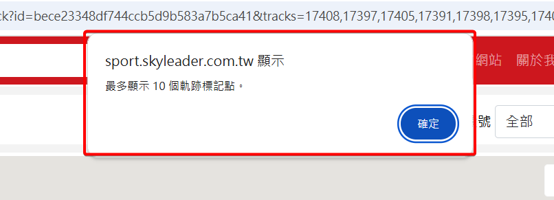

### 請先尋找地圖裡的``小黃人``。

### 將小黃人按住拖曳至你想觀看的地方後放開，呈現``水藍色``的道路才可觀看，觀看完按``ESC``鍵即可退回原地圖。

### 小黃人拖曳至想要觀看的點後放開，即可看到街景圖。

### ⭐️觀看完按ESC即可返回。

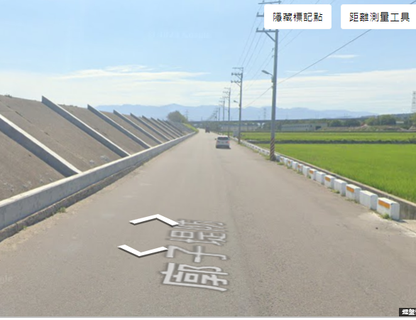

### 回到地圖畫面，將網頁往下滑會有鴿子飛行速度(水藍色線)、高度(灰色底)的水平面圖，水平面圖下方有詳細的飛行數據。

### 飛行數據往下滑，可看到GPS在每個標記點及平均數據。

### 如果您需要刪除軌跡，可勾選左側旁的`</img>`，並點擊上方顯示動作的欄位，點擊裡面的刪除即可刪除軌跡。

### ⭐️ ``請注意，刪除軌跡後會一並將該軌跡的設定及綁定資訊刪除，且刪除後無法復原。``

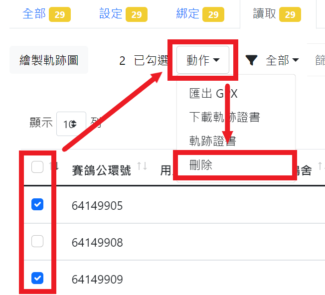

#### [返回目錄](#目錄)

## 篩選

### 點擊您要選擇的``各別活動``，在各別活動的頁面左側，您會看到篩選功能。

### ⭐️ 設定、綁定、讀取的分頁皆有此功能。

### 點擊篩選欄位旁的``全部``，您會看到其他可選擇的類別，提供您去做選擇。

### 點擊`</img>`圖示，下方會跳出進階篩選的功能，提供您去做選擇。

``

#### [返回目錄](#目錄)

## 軌跡證書

### 查看軌跡證書可勾選左側旁的`</img>`，並點擊上方顯示動作的欄位，點擊裡面的軌跡證書即可查看證書。

### ⭐️查看``複數軌跡證書``時，請先確保您同意此頁面的``彈跳視窗``

``

### ⭐️顯示軌跡證書的功能``最多支援10筆證書``，當勾選超過10筆證書時，會跳出下圖的視窗提醒您。

### 下圖為軌跡證書範例。

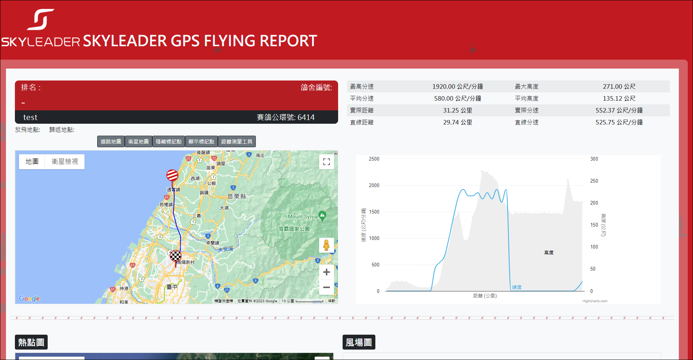

#### [返回目錄](#目錄)

## 下載軌跡證書

### 下載軌跡證書可勾選左側旁的`</img>`，並點擊上方顯示動作的欄位，點擊裡面的下載軌跡證書即可下載您所需的證書。

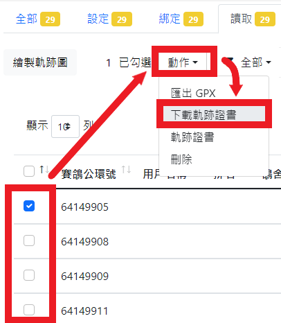

### ⭐️下載軌跡證書的功能``最多支援5筆證書``，當勾選超過5筆證書時，會跳出下圖的視窗提醒您。

### ⭐️ ``建議軌跡證書逐一下載，預防電腦超載。``

### 下圖為下載完的軌跡證書範例。

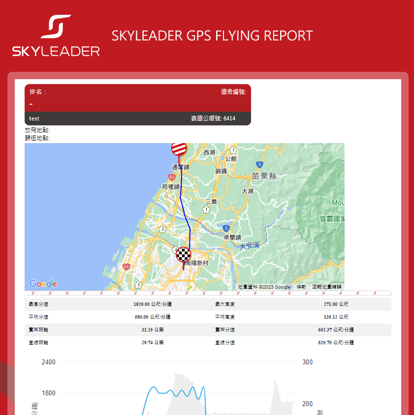

#### [返回目錄](#目錄)

# 商店

### 網頁最上方，點選商店，進入產品選購頁面。

# 官方網站

### 網頁最上方，點選官方網站，進入產品說明頁面。

# 關於我們

### 網頁最上方，點選關於我們，可更了解本公司產品、參與活動、設計創作、得獎殊榮。

