## 應用程式 
## 操作流程圖

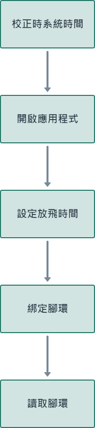</img>

#### [返回目錄](#目錄)

## 下載程式
### 請至我的活動中，點擊Pro進入下載軟體程序。
### :star:在使用軟體之前，請確認是否已新增活動。
### :star:設定腳環前，需先下載應用程式。

### 點擊完Pro後，請至「下載」尋找skyleader3壓縮檔，完成skyleader3資料夾解壓縮。

### 完成解壓縮後，點進skyleader3資料夾裡。

### 滑鼠左鍵快速點擊兩次:bird:skyleader3的應用程式，開啟使用者介面。

### 登入畫面如圖所示，請輸入您的 ACCOUNT:帳號及 PASSWORD:密碼，登入帳密與skyleader3網頁相同。

#### [返回目錄](#目錄)

## 變更語言
### 進入畫面後您會看到介面預設語言為您的系統預設語言，如無須調整請直接跳到:point_right:[設定放飛](#設定放飛)的操作說明。

### 請將滑鼠移動到程式左上方的Skyleader字樣上，點擊後會跳出一個選單，點選Language:語言，再點選選單內的Tradition Chinese:繁體中文。

### 點選完成後會跳出一個小視窗，如下圖所示。
### 點選小視窗上的OK按鍵，並重開程式即可完成語言的變更。

### 下圖為變化語言後的介面。

#### [返回目錄](#目錄)

## 設定放飛

### 接下來將使用繁體中文介面做設定放飛的步驟說明。
### 進入介面後點擊最左邊的圖示，並確認紅色按鈕的文字是否顯示「設定放飛」，確認無誤即可進行下一步。

### 請檢查您的傳輸座否有正常運作。

### 開始設定放飛時，請先點擊日期欄位旁的按鍵(1)，點選您在網頁上設定放飛的日期(2)，最後在點擊「查看(3)」，完成日期的選擇。

### 如果「查看」沒有設定放飛的日期，會如下圖所示的畫面，跳出一個提示視窗，告訴您該日無放飛設定。

### 下圖為讀取到活動後會呈現的畫面，請您檢查活動、時間及模式是否正確。

### 假設當天有超過一場活動，可點擊活動旁的按鈕，然後選擇要設定的活動。

### 將腳環設置於傳輸座後點擊畫面右邊的「設定放飛」按鈕，點擊後按鈕顏色會呈現灰色，代表點擊成功並開始寫入設定。

### 傳輸座欄位右邊會顯示腳環ID及設定的狀態。
### :star:當出現Success(成功)代表成功設定。
### :star:當出現Fail(失敗)代表設定失敗，請重新將腳環放置傳輸座。

### 完成設定後您可以回到👉 [skyleader3.0網頁](https://sport.skyleader.com.tw/Home/login)上，查看設定的腳環。

#### [返回目錄](#目錄)

## 匯入會員資料
### :star:若您要用電子環掃描的方式綁定腳環，綁定前要先匯入會員資料，請您前往您所要綁定腳環的活動頁面中。

### 請點擊匯入會員資料。
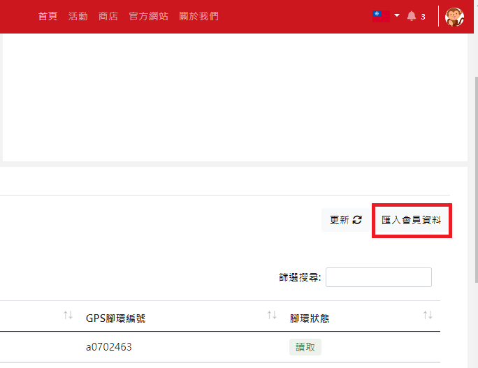

### 請先下載樣板，打開樣板填寫資料。

### 打開檔案後，您會看到以下的格式，請依照下方的說明填入資料。

### 選擇檔案，點擊剛填好的樣板檔案。

### 點選下一步。

### 您會在步驟二中看見剛剛匯入的資料。
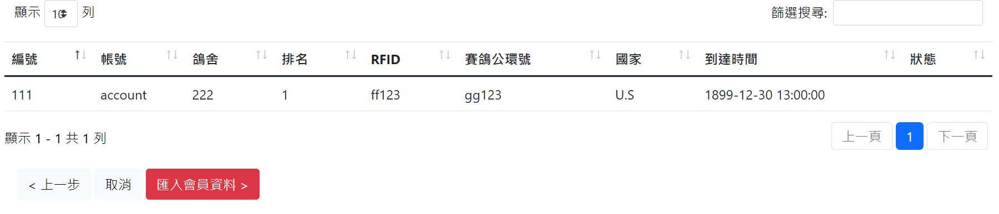

### 確認資料無誤後，點擊匯入會員資料，會在上方跳出小視窗詢問是否要匯入，點擊確定完成匯入。

### 進入步驟三後您可以看到匯入資料的狀況，點擊匯入完成，完成匯入會員資料的所有程序。
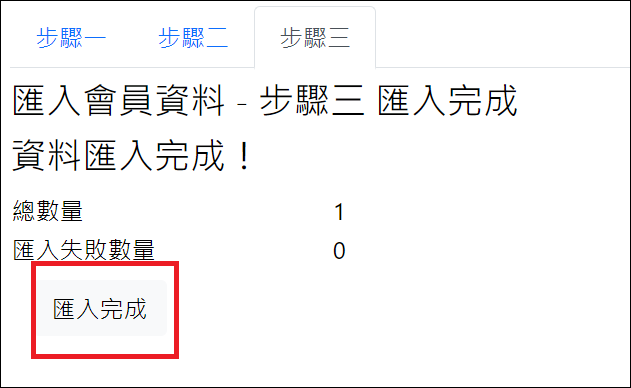

## 綁定GPS

### 在綁定前請先關閉應用程式，並連接上您的Rfid感應器，完成後再開啟程式以便程式偵測到您的感應器。
### :star:請不要在ComPort上連接Rfid感應器以外的裝置。

### 請於設定放飛的畫面上，將滑鼠移動到程式左上方的Skyleader字樣上，點擊後會跳出一個選單，點選Rfid，會跳出電子環感應器的設定介面。

### 點選Mode(模式)欄位，您可選擇對應自己感應器的廠牌。
### :star:ToPigeon: 鴿神一號
### :star:AnJie: 安捷

### 完成Mode點選後，可點選Segment(長度)，調整成您的電子環ID比對區段。

### 點擊Rfid旁的按鈕，可調整要截取的號碼間段。

### 假設我的電子環ID長度要8，但號碼為AB23334441，我只需要數字的比對區段，就要設定於3-10之間。

### 點擊按鈕後的示意圖

### 完成Rfid設定後，點擊中間的鴿子圖示</img>，進入綁定功能的介面。

### 綁定介面的示意圖

### 在綁定介面中是無法調整Rfid設定的，如需調整請再回到設定放飛的介面調整。

### 請先載入要綁定的活動，然後即可點開綁定按鈕右邊的RFID Reader。

### 點開後可以查看Reader欄位中的號碼是否與您的感應器相同，確認無誤後請點擊Binding Table回到原先的畫面。

### 滑鼠點擊公環旁的白色欄位，開始掃描電子環。

### 掃描完下方的GPS ID旁的白色欄位會開啟，緊接著掃描GPS腳環上的QRcode或手動輸入。
### :star:掃描完QRcode系統會自動匯入綁定資料。
### :star:手動輸入需在點擊下方的紅色綁定按鈕或點擊鍵盤上的Enter鍵，完成一次綁定。

### 介面右方的Binding Table表格中，會顯示您綁定的資料、筆數及時間，您可以透過這個表格確認資料是否正確。

### 如果有綁定錯誤的狀況，可以在公環欄位上輸入要解除綁定的ID，在按下Enter鍵後會跳出一個小視窗詢問您，是否要重新綁定，點擊yes即可重新綁定。

### 也可以透過先輸入公環號再點擊下方的PASS，先將公環資料紀錄於活動中，方便您之後要尋找要綁定的公環號。

### 點擊PASS匯入成功時會跳出的視窗。

### 當該GPS環並未設定放飛時，會跳出一個小視窗告訴您此狀況。

### 當您再匯入資料前發現有誤時，可以點擊Reset按鈕，會清除公環欄位及GPS ID欄位上的資料。

### 完成綁定後您可以回到👉 [skyleader3.0網頁](https://sport.skyleader.com.tw/Home/login)上，查看綁定的腳環及公環。

#### [返回目錄](#目錄)

## 讀取GPS

### 點擊左邊的放大鏡圖示，進入讀取功能的介面。

### 讀取介面的使用方式與設定放飛一樣，如想返回去看可點擊這裡:point_right:[設定放飛](#設定放飛)返回觀看。
### :star:請確定點擊完圖示後，右邊的按鈕是否為紅色讀取按鈕。
### :star:若要讀取腳環時，忘記到"讀取"介面，按成設定放飛，原要讀取的軌跡、資料則會被清除。

### 完成讀取後請您回到:point_right: [skyleader3.0網頁](https://sport.skyleader.com.tw/Home/login)上，進行查看軌跡的程序。

#### [返回目錄](#目錄)

## 活動內容
## 內容位置
### 設定腳環後，可至我的活動，點選(自己建立的活動名稱)。
### :star:進入至本場活動可看到設定、綁定、讀取數量， 若設定、綁定、讀取數量對不起來，可能是網頁停留未更新，請先按一下右邊的更新，讓網頁系統重新整理。

#### [返回目錄](#目錄)

## 活動照片
### 點入活動中，點選圖示，進入編輯頁面。
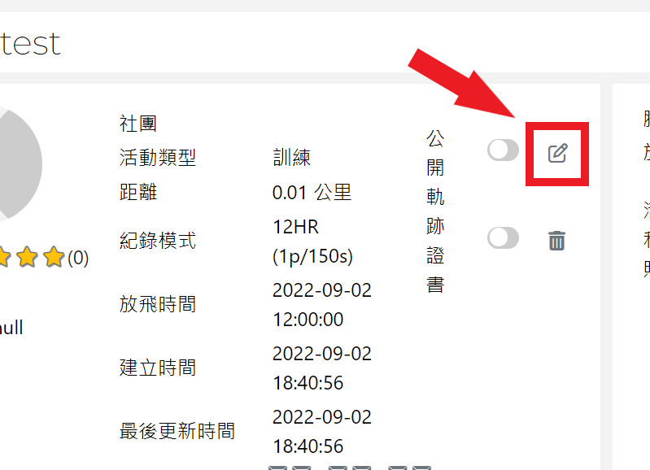

### 將頁面移至最底下，您會看見活動照片功能的位置，點擊相機圖示，選擇您要上傳的照片。

### 點擊照片欄位右側的儲存按鈕。
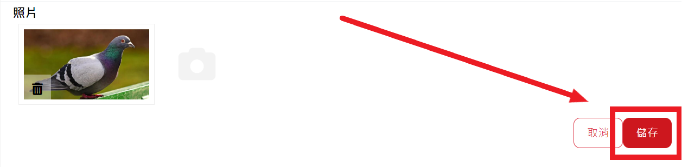

### 完成後您會看見上傳的照片出現在活動資訊中。

#### [返回目錄](#目錄)

## 設定
### 在這能看到設定編號、鴿舍、賽鴿公環號、GPS腳環編號、放飛時間、設備名稱、設定時間。

### 設定腳環後，如未綁定賽鴿公環號的腳環，在未綁定之前賽鴿公環號會顯示null，綁定後才會有賽鴿公環號。

#### [返回目錄](#目錄)

## 綁定
### 在這能看到綁定編號、鴿舍、賽鴿公環號、GPS腳環編號、放飛時間、設備名稱、綁定時間。
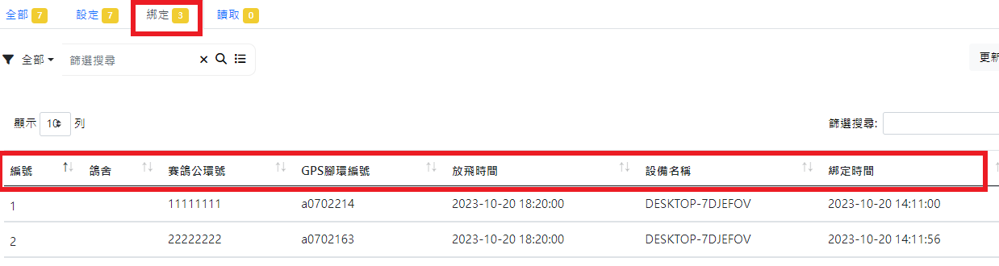

#### [返回目錄](#目錄)

## 讀取
### 點選讀取，能看到賽鴿公環號、用戶名稱、排名、鴿舍、GPS腳環編號、軌跡第一點時間、國家、歸返時間、分段資料、直線距離、直線分速。
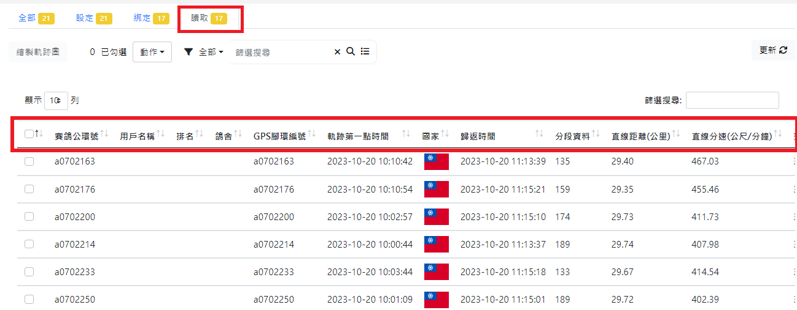

### 若想知道各個資訊的排序，可點擊名稱旁邊的排序，系統會自動編排。

### 要觀看鴿子飛行軌跡，請點選第一排方框勾選您想觀看的軌跡，再按繪製軌跡圖。
### :star:勾選軌跡時，建議以少量多次觀看，會造成網頁過度加載。
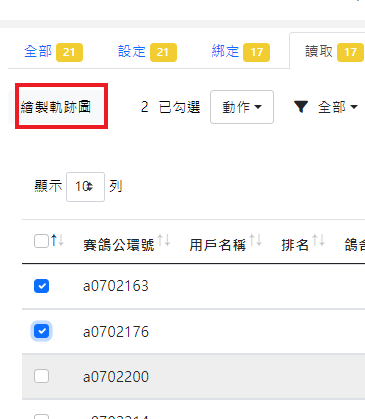

### 點擊上方欄位的即可勾選所有賽鴿軌跡。
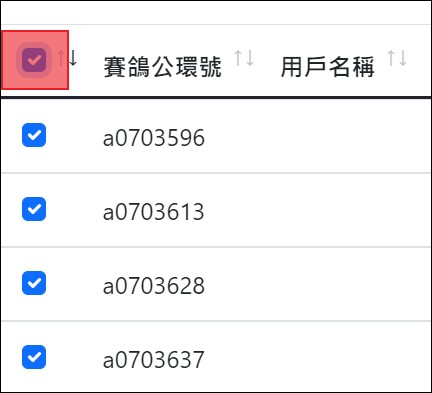

### 也可以直接點擊要看的腳環軌跡，系統會在同頁面中顯示給您看。
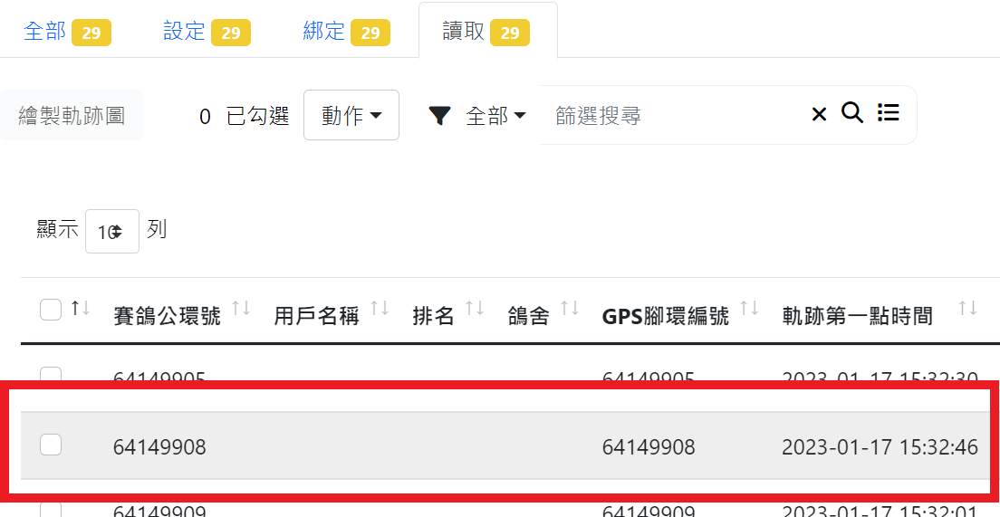

### 如下圖所示。

### 下圖紅框處裡的紅字會顯示您目前點到哪一組公環。
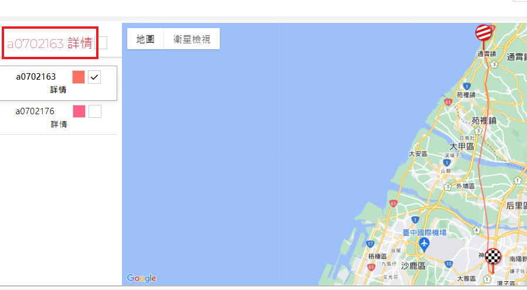

### 若要看軌跡圖，請在方格中☑，在點擊顯示標記點。

### 點擊顯示標記點後，會出現GPS標記的軌跡。
### :star:每個點都能點進去看詳細時間、速度、方向、高度。

### :star:顯示軌跡點的功能最多支援10筆軌跡，當勾選超過10筆軌跡時，會跳出下圖的視窗提醒您。

###  請先尋找地圖裡的小黃人。

### 將小黃人按住拖曳至你想觀看的地方後放開，呈現水藍色的道路才可觀看，觀看完按ESC鍵即可退回原地圖。
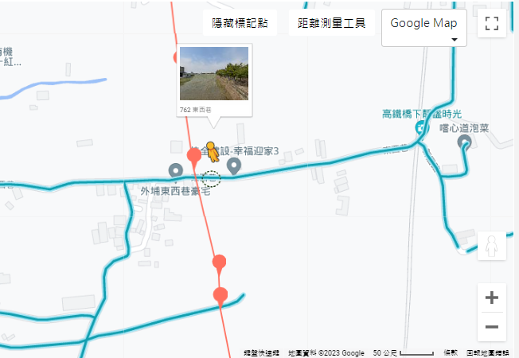

### 小黃人拖曳至想要觀看的點後放開，即可看到街景圖。
### :star:觀看完按ESC即可返回。

### 回到地圖畫面，將網頁往下滑會有鴿子飛行速度(水藍色線)、高度(灰色底)的水平面圖，水平面圖下方有詳細的飛行數據。
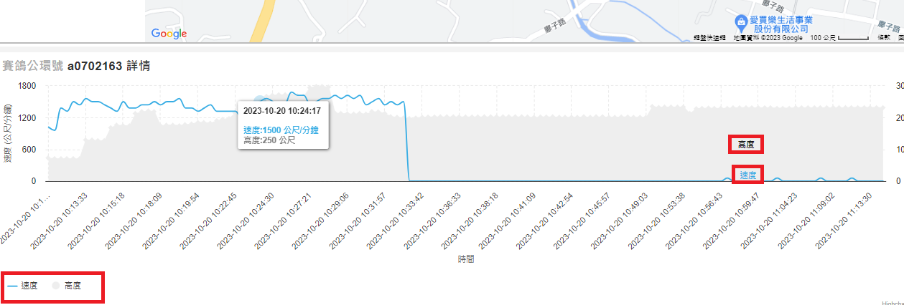

### 飛行數據往下滑，可看到GPS在每個標記點及平均數據。

### 如果您需要刪除軌跡，可勾選左側旁的</img>，並點擊上方顯示動作的欄位，點擊裡面的刪除即可刪除軌跡。
### :star: 請注意，刪除軌跡後會一並將該軌跡的設定及綁定資訊刪除，且刪除後無法復原。

#### [返回目錄](#目錄)

## 篩選
### 點擊您要選擇的各別活動，在各別活動的頁面左側，您會看到篩選功能。
### :star: 設定、綁定、讀取的分頁皆有此功能。
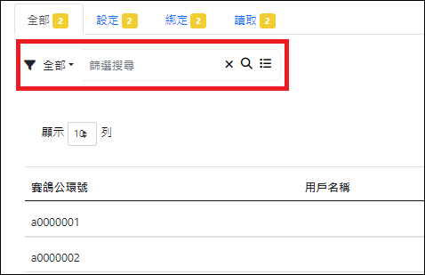

### 點擊篩選欄位旁的全部，您會看到其他可選擇的類別，提供您去做選擇。
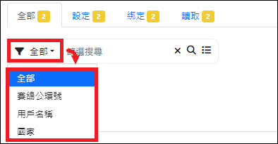

### 點擊</img>圖示，下方會跳出進階篩選的功能，提供您去做選擇。

#### [返回目錄](#目錄)