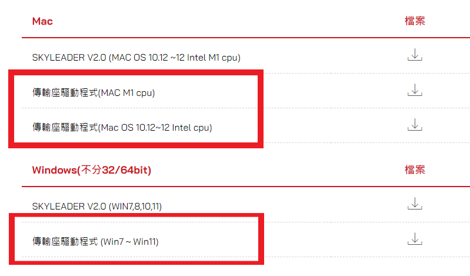
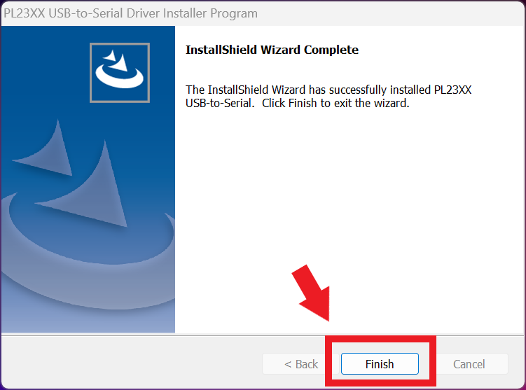
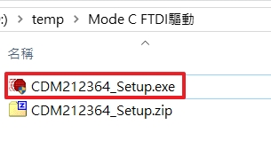
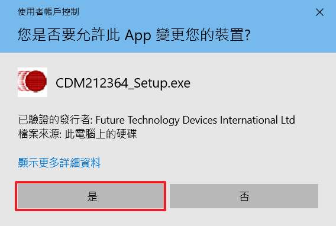
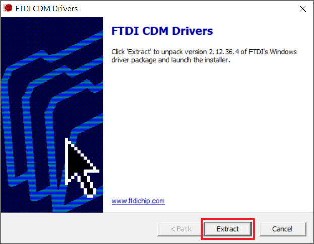
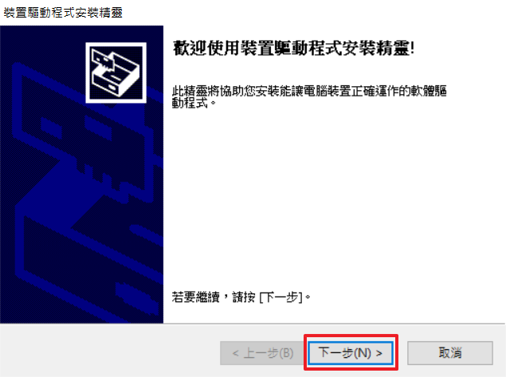
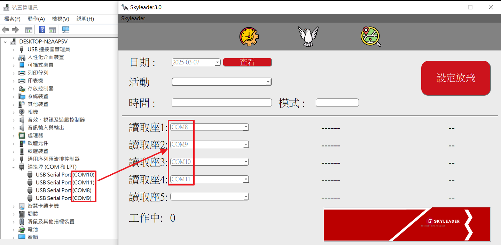

# Window AP 應用程式 

## 傳輸座驅動程式安裝

**
同一台電腦只需要第一次安裝驅動，之後使用不需要再次安裝。
**

### Mode 2 與 Mode 4U 傳輸座驅動安裝
1. 請先至:point_right: [skyleader.tw檔案下載](https://www.skyleader.tw/%E6%AA%94%E6%A1%88%E4%B8%8B%E8%BC%89/)頁面中。
2. 選擇您使用的電腦作業系統，點擊圖示，即可下載傳輸座驅動程式，這邊以 Windows 系統為範例， MacOS 系統 目前只支援 Skyleader 2.0。

	

3. 於下載資料夾中找到剛剛下載的傳輸座驅動壓縮檔。

	

4. 滑鼠點擊壓縮檔一下，再按下滑鼠右鍵，點選功能視窗中的圖示，解壓縮檔案。

	

5. 找到剛剛解壓縮的檔案，點擊兩下，再點擊下方的檔案。

	

6. 點擊有著圖示的檔案，開始安裝傳輸座驅動程式。

	

7. 開啟驅動程式後，點擊Next按鈕。

8. 完成安裝後，您會看到下方圖示所示的畫面，點擊Finish按鈕，即可完成安裝傳輸座驅動的所有步驟。

	

### Mode C傳輸座驅動安裝

1. 在 Windows 10/11系統，插上傳輸座後，等待一段時間系統會自動下載並安裝驅動程式，如未成功自動下載，必須手動 [下載](https://ftdichip.com/wp-content/uploads/2021/08/CDM212364_Setup.zip) 並安裝驅動。
2. 驅動下載完成後，將檔案解壓縮後，開啟"CDM212364_Setup.exe"檔案開始安裝傳輸座驅動程式。

	
	
3. 跳出"使用者帳戶控制"提示窗，選擇"是"。

	

4. FTDI CDM Drivers視窗，選擇 "Extract"。

	

5. 裝置驅動程式安裝精靈視窗，選擇"下一步"。

	

6. 授權合約，選擇"下一步"。

	
	
7. 選擇"完成"，結束安裝驅動程式。

	
	
8. 到Windows系統"裝置管理員"，選擇"連接埠(COM 和 LPT)"，如有出現COM號，表示安裝成功。

	

## 操作流程圖

</img>

## 校正系統時間
**
因設定時間是以系統時間來計算，避免系統時間不準確，導致放飛設定時間與實際時間有誤差，所以必須校正系統時間。
**
1. 開啟標準時間網站：https://tw.piliapp.com/time-now/tw/taipei/ 或 https://time.is
2. 與系統時間比對是否同步?不同步則必須校正時間

	

3. 校正時間步驟如下：
	- 開啟系統設定，選擇時間與語言選項
	
	

	- 先關閉自動設定時間，之後手動設定日期與時間，將時間隨便調整，之後按立即同步，再把自動設定時間開啟。

	
	
	- 與系統時間比對是否同步?如同步則完成校正時間，不同步則重複上述步驟，直到時間同步。

	

## 下載程式
1. 請至我的活動中，點擊Pro進入下載軟體程序。
	- 目前最新版 Windows AP 尚未放上網站 ，暫時在[這裡](https://minxin-my.sharepoint.com/:u:/g/personal/howdi_minxincorp_com/EZhubSv6AOVIuDgYjBW_nYgB3KiUM-xQa44SgvzSmXY_SQ?e=xtRmcy&download=1)下載

**
:star:在使用軟體之前，請確認是否已新增活動。  :star:設定腳環前，需先下載應用程式。 
**

4. 點擊完Pro後，請至「下載」尋找skyleader3壓縮檔，完成skyleader3資料夾解壓縮。

	

5. 完成解壓縮後，點進skyleader3資料夾裡。

	

6. 滑鼠左鍵快速點擊兩次:bird:skyleader3的應用程式，開啟使用者介面。

	

7. 登入畫面如圖所示，請輸入您的 ACCOUNT:帳號及 PASSWORD:密碼，登入帳密與 skyleader3 網頁相同。

	

## 變更語言
1. 進入畫面後您會看到介面預設語言為您的系統預設語言，如無須調整請直接跳到:point_right:[設定放飛](#設定放飛)的操作說明。

	

2. 請將滑鼠移動到程式左上方的Skyleader字樣上，點擊後會跳出一個選單，點選Language:語言，再點選選單內的Tradition Chinese:繁體中文。

	

3. 點選完成後會跳出一個小視窗，如下圖所示。
	- 點選小視窗上的OK按鍵，並重開程式即可完成語言的變更。
	
	

4. 下圖為變化語言後的介面。

	

## 設定放飛

- 接下來將使用繁體中文介面做設定放飛的步驟說明。
- Mode C 3352腳環的設定時間參數，目前只能使用 periodic.json 來設定參數，詳細參考 [Mode C 紀錄模式設定](#Mode C 紀錄模式設定)

### Mode C 紀錄模式設定
- 因目前 skyleaer3.0 網站和Windows AP還不支援直接設定 Mode C 腳環紀錄模式，需要使用 periodic.json 來設定參數

-  periodic.json 需要放在 skyleader3 資料夾下，與skyleader3程式檔同一個資料夾。

	

- Windows AP只會讀取periodic.json裡面第一筆參數資料，如需要改其他參數，需要將參數移至第一筆

- 如有放置periodic.json檔案，Windows AP會忽略 Web 網站上創活動時的紀錄模式，如需使用網站上的紀錄模式，請刪除 periodic.json 檔案，或將檔案移至其他資料夾。
	- periodic.json檔案和示意圖[下載](https://minxin-my.sharepoint.com/:u:/g/personal/howdi_minxincorp_com/EZZEKY2r9u1PlEX5tq37yiQBw0zir3dwKVCChAOHb0fIIQ?e=xHNVrf)(需登入Onedrive)

### 開始設定  

**
:star:在使用軟體之前，請確認是否已新增活動。  :star:設定腳環前，需先下載應用程式。 
**

1. 進入介面後點擊最左邊的圖示，並確認紅色按鈕的文字是否顯示「設定放飛」，確認無誤即可進行下一步。

	

2. 請檢查您的傳輸座否有正常運作。

	

3. 開始設定放飛時，請先點擊日期欄位旁的按鍵(1)，點選您在網頁上設定放飛的日期(2)，最後在點擊「查看(3)」，完成日期的選擇。

	
	
4. 如果「查看」沒有設定放飛的日期，會如下圖所示的畫面，跳出一個提示視窗，告訴您該日無放飛設定。

	

5. 下圖為讀取到活動後會呈現的畫面，請您檢查活動、時間及模式是否正確。

	

6. 假設當天有超過一場活動，可點擊活動旁的按鈕，然後選擇要設定的活動。

	

7. 將腳環設置於傳輸座後點擊畫面右邊的「設定放飛」按鈕，點擊後按鈕顏色會呈現灰色，代表點擊成功並開始寫入設定。

	
8. 傳輸座欄位右邊會顯示腳環ID及設定的狀態。
	- :star:當出現Success(成功)代表成功設定。
	- :star:當出現Fail(失敗)代表設定失敗，請重新將腳環放置傳輸座。
	- 設定失敗參考[錯誤代碼清單](https://minxin-my.sharepoint.com/:b:/g/personal/howdi_minxincorp_com/Ee0f9yMAwU1LvTJz6g5iezoB1cuL9X6UTUs1ynnrEq8Avg?e=6oR6uK)，(需要登入Onedrive)
	
	
9. 完成設定後您可以回到👉 [skyleader3.0網頁](https://sport.skyleader.com.tw/Home/login)上，查看設定的腳環。

	

## 綁定GPS腳環

- 如需要使用掃描電子環方式綁定，需要先匯入會員資料，詳細步驟參考[匯入會員資料說明](活動.md#匯入會員資料)。

**
:star: 在綁定前請先關閉應用程式，並連接上您的Rfid感應器，完成後再開啟程式以便程式偵測到您的感應器。  :star:請不要在ComPort上連接Rfid感應器以外的裝置，有可能會偵測不到Rfid感應器。 
**

1. 請於設定放飛的畫面上，將滑鼠移動到程式左上方的Skyleader字樣上，點擊後會跳出一個選單，點選Rfid，會跳出電子環感應器的設定介面。

	

2. 點選Mode(模式)欄位，您可選擇對應自己感應器的廠牌。
	- ToPigeon: 鴿神
	- AnJie: 安捷
	
	

3. 完成Mode點選後，可點選Segment(長度)，調整成您的電子環ID比對區段。

	

4. 點擊Rfid旁的按鈕，可調整要截取的號碼間段。

	

5. 假設我的電子環ID長度要8，但號碼為AB23334441，我只需要數字的比對區段，就要設定於3-10之間。
6. 點擊按鈕後的示意圖

	

7. 完成Rfid設定後，點擊中間的鴿子圖示</img>，進入綁定功能的介面。

	

8. 綁定介面的示意圖

	

9. 在綁定介面中是無法調整Rfid設定的，如需調整請再回到設定放飛的介面調整。

	

10. 請先載入要綁定的活動，然後即可點開綁定按鈕右邊的RFID Reader。

	

11. 點開後可以查看Reader欄位中的號碼是否與您的感應器相同，確認無誤後請點擊Binding Table回到原先的畫面。

	

12. 滑鼠點擊公環旁的白色欄位，開始掃描電子環。

	

13. 掃描完下方的GPS ID旁的白色欄位會開啟，緊接著掃描GPS腳環上的QRcode或手動輸入。
	- 掃描完QRcode系統會自動匯入綁定資料。
	- 手動輸入需在點擊下方的紅色綁定按鈕或點擊鍵盤上的Enter鍵，完成一次綁定。

	

14. 介面右方的Binding Table表格中，會顯示您綁定的資料、筆數及時間，您可以透過這個表格確認資料是否正確。

	

15. 如果有綁定錯誤的狀況，可以在公環欄位上輸入要解除綁定的ID，在按下Enter鍵後會跳出一個小視窗詢問您，是否要重新綁定，點擊yes即可重新綁定。

	

16. 也可以透過先輸入公環號再點擊下方的PASS，先將公環資料紀錄於活動中，方便您之後要尋找要綁定的公環號。

	

17. 點擊PASS匯入成功時會跳出的視窗。

	

18. 當該GPS環並未設定放飛時，會跳出一個小視窗告訴您此狀況。

	

19. 當您再匯入資料前發現有誤時，可以點擊Reset按鈕，會清除公環欄位及GPS ID欄位上的資料。

	

20. 完成綁定後您可以回到👉 [skyleader3.0網頁](https://sport.skyleader.com.tw/Home/login)上，查看綁定的腳環及公環。

	

## 讀取GPS腳環

1. 點擊左邊的放大鏡圖示，進入讀取功能的介面。

	

2. 讀取介面的使用方式與設定放飛一樣，如想返回去看可點擊這裡:point_right:[設定放飛](#設定放飛)返回觀看。

**
 :star:請確定點擊完圖示後，右邊的按鈕是否為紅色讀取按鈕。   :star:若讀取腳環時，忘記到"讀取"介面，按成設定放飛，原要讀取的軌跡、資料則會被清除。 
**

3. 完成讀取後請您回到:point_right: [skyleader3.0網頁](https://sport.skyleader.com.tw/Home/login)上，進行查看軌跡的程序。

4. 讀取失敗參考[錯誤代碼清單](https://minxin-my.sharepoint.com/:b:/g/personal/howdi_minxincorp_com/Ee0f9yMAwU1LvTJz6g5iezoB1cuL9X6UTUs1ynnrEq8Avg?e=6oR6uK)，(需要登入Onedrive)