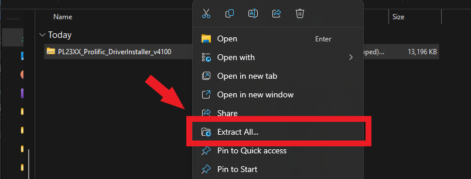
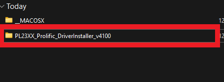

# 基礎功能
## 註冊帳號
1. 請先至:point_right: [skyleader3.0網頁](https://sport.skyleader.com.tw/Home/login)登入頁面，再點擊頁面中間的建立帳號，進行帳號註冊。

2. 請選擇使用電子信箱或手機號碼進行註冊。
3. 填寫完電子信箱/手機號碼及密碼後，請您打勾☑註冊前，請您同意服務及隱私政策欄位，再點擊註冊按鈕。
4. :star:請至您的電子信箱/手機號碼收取驗證碼，並完成驗證，驗證完成即可登入至首頁。

## 傳輸座驅動安裝
### Mode 2 與 Mode 4U 驅動安裝
1. 請先至:point_right: [skyleader.tw檔案下載](https://www.skyleader.tw/%E6%AA%94%E6%A1%88%E4%B8%8B%E8%BC%89/)頁面中。
2. 選擇您使用的電腦作業系統，點擊圖示，即可下載傳輸座驅動程式。

3. 於下載資料夾中找到剛剛下載的傳輸座驅動壓縮檔。

4. 滑鼠點擊壓縮檔一下，再按下滑鼠右鍵，點選功能視窗中的圖示，解壓縮檔案。

5. 找到剛剛解壓縮的檔案，點擊兩下，再點擊下方的檔案。

6. 點擊有著圖示的檔案，開始安裝傳輸座驅動程式。

7. 開啟驅動程式後，點擊Next按鈕。

8. 完成安裝後，您會看到下方圖示所示的畫面，點擊Finish按鈕，即可完成安裝傳輸座驅動的所有步驟。

## 忘記密碼重設
1. 請先至:point_right: [skyleader3.0網頁](https://sport.skyleader.com.tw/Home/login)登入頁面，點擊密碼欄位右下方的忘記密碼，進行密碼重設。

2. 您可以選擇輸入電子信箱/手機號碼的方式重設密碼。
3. 密碼重設的簡訊會依據您給的電子信箱/手機號碼進行發送，點擊送出按鈕即可發訊。
4. :star: 如想使用手機號碼重設密碼，請點擊送出按鈕上方的切換至手機號碼即可切換。

5. 切換至手機號碼後的畫面如下圖所示。

## 網頁指南
Skyleader3上方為[首頁](#首頁)、[活動](#活動)、[商店](#商店)、[官方網站](#官方網站)、[關於我們](#關於我們)，可點擊切換至您所需的頁面。

## 用戶資訊
1. 會員資料
2. 畫面右上角點選自己的頭貼，可變更會員資料或登出帳號。

3. 點擊會員資料會進入到會員資料的頁面，即可變更會員資料。

## 我的帳戶
- 點擊我的帳戶可觀看會員成立時間及登入資訊變更。

## 偏好設定
- 點擊顯示偏好設定可設定距離的單位。

## 社交功能
### 首頁社交功能
1. 點擊首頁中的熱門軌跡，可看見現在熱門中的軌跡資訊，軌跡資訊的下方有關注、按讚、留言及分享的功能，提供您做使用。

2. 點擊留言圖示，下方將顯示出讓您填寫留言的區塊，給予:star:數和填寫完畢後，請點擊張貼按鈕，即可上傳留言。

3. 當您點擊及旁的文字時，會跳出一個小視窗，您可以依您的喜好做選擇。

4. :star:按讚的小視窗。

</img>

5.:star:留言的小視窗。

</img>

