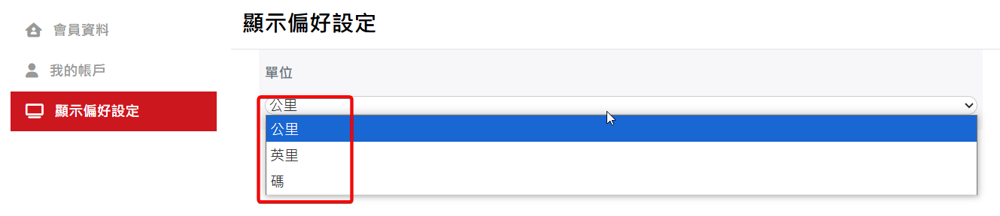

# 基礎功能
## 註冊帳號
1. 請先至:point_right: [skyleader3.0網頁](https://sport.skyleader.com.tw/Home/login)登入頁面，再點擊頁面中間的建立帳號，進行帳號註冊。

	

2. 請選擇使用電子信箱或手機號碼進行註冊。
3. 填寫完電子信箱/手機號碼及密碼後，請您打勾☑註冊前，請您同意服務及隱私政策欄位，再點擊註冊按鈕。
4. :star:請至您的電子信箱/手機號碼收取驗證碼，並完成驗證，驗證完成即可登入至首頁。

	
5. E-mail註冊帳號收驗證信時，某些E-mail服務商會將信件歸類在垃圾郵件，例如微軟提供的e-mail服務，如在收件匣找不到驗證郵件時，可在垃圾郵件尋找。
## 忘記密碼重設
1. 請先至:point_right: [skyleader3.0網頁](https://sport.skyleader.com.tw/Home/login)登入頁面，點擊密碼欄位右下方的忘記密碼，進行密碼重設。

	

2. 您可以選擇輸入電子信箱/手機號碼的方式重設密碼。
3. 密碼重設的簡訊會依據您給的電子信箱/手機號碼進行發送，點擊送出按鈕即可發訊。
4. :star: 如想使用手機號碼重設密碼，請點擊送出按鈕上方的切換至手機號碼即可切換。

	

5. 切換至手機號碼後的畫面如下圖所示。

	

## 上方導覽列
Skyleader3上方為首頁、活動、商店、官方網站、關於我們，可點擊切換至您所需的頁面。
- 首頁：連結熱門軌跡頁面。
- 活動：連結我的活動列表。
- 商店：連結官網商店　https://www.skyleader.com/products/
- 官方網站：連結官網　https://www.skyleader.com
- 關於我們：連結官網關於我們　https://www.skyleader.com/brand-story/

   

## 用戶資訊
### 會員資料
- 畫面右上角點選自己的頭貼，可變更會員資料或登出帳號。

	

- 點擊會員資料會進入到會員資料的頁面，即可變更會員資料。

	

### 我的帳戶
- 點擊我的帳戶可觀看會員成立時間及登入資訊變更。

	

### 偏好設定

- 點擊顯示偏好設定可設定軌跡的距離和速度的單位，預設為公里。

	

