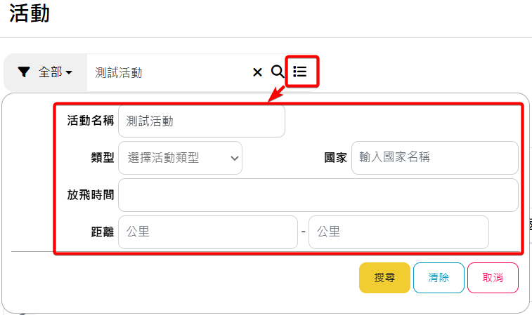
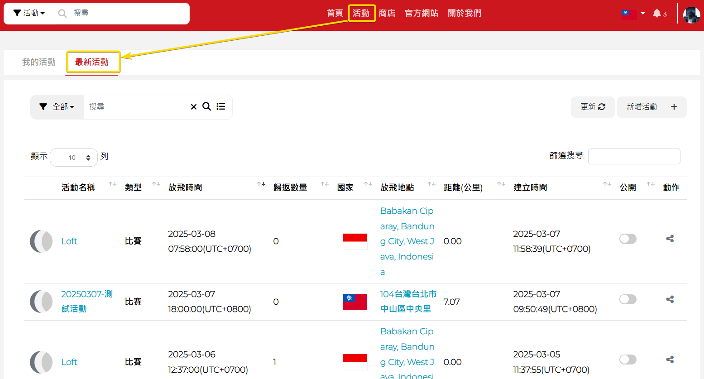

# 活動
## 新增活動
### 活動建立

**
:star: 建立活動時，放飛時間須注意是否與設定當下的時間超過5天，WindowsAP會限制5天內地的活動才可以設定
**

1. 登入後，點左上角新增活動。

	

2. 也可於活動頁面中右側的新增活動。

	

3. 新增活動前，必須注意每個欄位旁是否有 * (必填欄) ，若有出現"  * "必須填寫完才有辦法新增比賽。
4. 輸入您的活動名稱。

	

5. 點選活動類型比賽，再點選紀錄模式選擇您所需的模式。

6. :star:12HR為一般常用設定值

	

7. 放飛地點與歸返地點設定。

	

8. 由下方地圖去設定，，往下滑至地圖，按一下設定地點，按下去會變成停止設定的文字，這樣才代表有點擊成功。

	

9. 點擊完設定地點後，即可在地圖上設置放飛地點及歸返地點。
10. 若想變更地點，直接按住地圖裡的起點(放飛地點)或終點(歸返地點)的大頭圖標做拖曳至想變更的位置，即可完成地點變更。
11. :star:點第一下設定放飛地點，點擊第二下設定歸返地點。

	

12. 也可點擊右鍵選擇要設置放飛或歸返地點。

	

13. 您可以參考地圖左上有地圖、衛星檢視、街景觀看來尋找放飛及歸返的地點。

14. :star:地圖:地圖形對比圖。

	

16. :star:衛星檢視:地名對比圖。

	

### 街景觀看
1. 請先尋找地圖裡的小黃人，將小黃人按住拖曳至你想觀看的地方放開。
2. :star:呈現水藍色的道路才可觀看，觀看完按ESC鍵即可退回原地圖。

	

### 放飛時間、國家、活動說明
- 設定放飛時間、放飛國家  ，活動說明為非必要填寫欄位，可依您的需求填寫註記。

	

### 距離單位更換
- 系統將會以放飛地點及歸返地點計算出距離，可選擇單位。

	

### 活動設定是否公開、軌跡證書生成
1. 可依您的需求選擇是否公開此次活動內容。
2. :star:若有要分享給其他人，請記得設公開。

	

3. 點擊公開後的圖示會呈現深灰色，白色按鈕會跑至右邊，表示設為公開。
- 請參考下圖 👇

	
4. 軌跡證書生成功能開啟或關閉同上。

### 私人記事
- 為非必填欄位，本帳號才看得到。

	

按新增活動，完成活動創辦

   

### 確認活動資訊是否正確
- 新增活動完會自動跳入至我的活動，左鍵點擊一下剛創辦的比賽，活動說明就會出現，確認活動資訊是否正確。

	

## 編輯活動
1. 在您的活動清單右側紅圈處(圖示為三個點)，點擊編輯進入編輯頁面。

	

2. 您也可以點入活動中，點選圖示，進入編輯頁面。

	

3. 下圖為編輯活動頁面範例。 

	

4. :star: 當放飛時間已經到或有以設定的腳環時，將會限制修改部分資訊，只能編輯活動名稱、活動說明、私人記事、活動公開開關、生成軌跡證書功能開關、活動照片。

	

## 刪除活動
1. 在您的活動清單右側紅圈處(圖示為三個點)，點擊刪除即可刪除該活動。
2. :star:請注意，刪除活動後，將無法還原。

	

3. 如果您需要刪除多個活動可勾選左側旁的</img>，並點擊上方顯示動作的欄位，點擊裡面的刪除即可刪除多個活動。

	

## 分享活動
1. 活動可分享給其他人，觀看者必須是會員才有辦法觀看。
2. :star:請將活動先設為公開才能分享。

	

## 活動內容
### 內容位置
1. 設定腳環後，可至我的活動，點選(自己建立的活動名稱)。
2. :star:進入至本場活動可看到設定、綁定、讀取數量， 若設定、綁定、讀取數量對不起來，可能是網頁停留未更新，請先按一下右邊的更新，讓網頁系統重新整理。

	

### 活動照片
1. 點入活動中，點選圖示，進入編輯頁面。

	

2. 將頁面移至最底下，您會看見活動照片功能的位置，點擊相機圖示，選擇您要上傳的照片。

	

3. 點擊照片欄位右側的儲存按鈕。

	

4. 完成後您會看見上傳的照片出現在活動資訊中。

	

### 設定
1. 在這能看到設定編號、鴿舍、賽鴿公環號、GPS腳環編號、放飛時間、設備名稱、設定時間。

	

2. 設定腳環後，如未綁定賽鴿公環號的腳環，在未綁定之前賽鴿公環號會顯示null，綁定後才會有賽鴿公環號。

	

### 綁定
- 在這能看到綁定編號、鴿舍、賽鴿公環號、GPS腳環編號、放飛時間、設備名稱、綁定時間。

	

### 讀取
1. 點選讀取，能看到賽鴿公環號、用戶名稱、排名、鴿舍、GPS腳環編號、軌跡第一點時間、國家、歸返時間、分段資料、直線距離、直線分速。

	

2. 若想知道各個資訊的排序，可點擊名稱旁邊的排序，系統會自動編排。

	

3. 要觀看鴿子飛行軌跡，請點選第一排方框勾選您想觀看的軌跡，再按繪製軌跡圖。
4. :star:勾選軌跡時，建議以少量多次觀看，會造成網頁過度加載。

	

5. 點擊上方欄位的即可勾選所有賽鴿軌跡。

	

6. 也可以直接點擊要看的腳環軌跡，系統會在同頁面中顯示給您看。

	

7.如下圖所示。

   

8. 下圖紅框處裡的紅字會顯示您目前點到哪一組公環。

	

9. 若要看軌跡圖，請在方格中☑，在點擊顯示標記點。

	

10. 點擊顯示標記點後，會出現GPS標記的軌跡。
11. :star:每個點都能點進去看詳細時間、速度、方向、高度。

	

12. :star:顯示軌跡點的功能最多支援10筆軌跡，當勾選超過10筆軌跡時，會跳出下圖的視窗提醒您。
	
	

13. 請先尋找地圖裡的小黃人。

	

14. 將小黃人按住拖曳至你想觀看的地方後放開，呈現水藍色的道路才可觀看，觀看完按ESC鍵即可退回原地圖。

	

15. 小黃人拖曳至想要觀看的點後放開，即可看到街景圖。

	

16. :star:觀看完按ESC即可返回。

17. 回到地圖畫面，將網頁往下滑會有鴿子飛行速度(水藍色線)、高度(灰色底)的水平面圖，水平面圖下方有詳細的飛行數據。

	

18. 飛行數據往下滑，可看到GPS在每個標記點及平均數據。

	

19. 如果您需要刪除軌跡，可勾選左側旁的</img>，並點擊上方顯示動作的欄位，點擊裡面的刪除即可刪除軌跡。
20. :star: 請注意，刪除軌跡後會一並將該軌跡的設定及綁定資訊刪除，且刪除後無法復原。

	

### 軌跡分享

1. 腳環讀取完成後，可在每一筆軌跡最後的分享圖示，將軌跡分享，可分享至Facebook、Twitter( X )、複製連結。

	

2. 其他軌跡分享方式參考[社交功能](社交功能.md)

### 篩選
1. 點擊您要選擇的各別活動，在各別活動的頁面左側，您會看到篩選功能。
2. :star: 設定、綁定、讀取的分頁皆有此功能。

	

3. 點擊篩選欄位旁的全部，您會看到其他可選擇的類別，提供您去做選擇。

	

4. 點擊</img>圖示，下方會跳出進階篩選的功能，提供您去做選擇。

	

5. 國家名稱搜尋需要使用兩碼的代碼，例如台灣需輸入代碼  **TW** ，其餘國家代碼可參考此 [連結](https://www.iban.com/country-codes) 的 ISO 3166-1 alpha-2 code。 

### 軌跡證書
1. 查看軌跡證書可勾選左側旁的</img>，並點擊上方顯示動作的欄位，點擊裡面的軌跡證書即可查看證書。
2. :star:查看複數軌跡證書時，請先確保您同意此頁面的彈跳視窗

	

3. :star:顯示軌跡證書的功能最多支援10筆證書，當勾選超過10筆證書時，會跳出下圖的視窗提醒您。

	

4. 下圖為軌跡證書範例。

	

#### 下載軌跡證書
1.下載軌跡證書可勾選左側旁的</img>，並點擊上方顯示動作的欄位，點擊裡面的下載軌跡證書即可下載您所需的證書。

   

2. :star:下載軌跡證書的功能最多支援5筆證書，當勾選超過5筆證書時，會跳出下圖的視窗提醒您。

3. :star: 建議軌跡證書逐一下載，避免生成出現問題。

	

4. 下圖為下載完的軌跡證書範例。

	

### 匯入會員資料

**
:star: 若您要用電子環掃描的方式綁定腳環，綁定前要先匯入會員資料，請您前往您所要綁定腳環的活動頁面中，找到"匯入會員資料"功能 
**

   

1. 請點擊匯入會員資料。

	

2. 請先下載樣板，打開樣板填寫資料。

	

3. 打開檔案後，您會看到以下的格式，請依照下方的說明填入資料。

	

4. 選擇檔案，點擊剛填好的樣板檔案。

	

5. 點選下一步。

	

6. 您會看見剛剛匯入的資料。

	

7. 確認資料無誤後，點擊匯入會員資料，會在上方跳出小視窗詢問是否要匯入，點擊確定完成匯入。

	
	
8. 進入步驟三後您可以看到匯入資料的狀況，點擊匯入完成，完成匯入會員資料的所有程序。

	

## 活動搜尋

### 搜尋所有活動

**
可以搜尋所有Skyleader3.0帳號所創建的活動
**

#### 使用導覽列搜尋框

1. 登入 Skyleader Web 網站後，在上方導覽列，可輸入活動名稱關鍵字，輸入完成後按 Enter 鍵，會搜尋符合關鍵字的活動名稱。

	

2. 搜尋關鍵字以標籤顯示，如需要將關鍵字搜尋取消，可點擊關鍵字旁"X"。
	
	
	
3. 可以使用左側選擇關鍵字類型，有"全部"、"活動類型"、"活動名稱"、"國家"：
	- 全部：搜尋 "活動類型"、"活動名稱"、"國家"全部類型關鍵字
	- 活動類型：比賽或訓練，可輸入中文或英文 "race"或"train"
	- 活動名稱：依照輸入關鍵字搜尋活動名稱
	- 國家：需要須入國家代碼，例如台灣需輸入"TW"，其餘國家代碼可參考此 [連結](https://www.iban.com/country-codes) 的 ISO 3166-1 alpha-2 code。 

	
	
4. 可點擊右側圖標使用詳細搜尋功能：
	- 活動名稱：依照輸入關鍵字搜尋活動名稱。
	- 活動類型：在下拉選單可選擇比賽或訓練。
	- 國家：需要須入國家代碼，例如台灣需輸入"TW"，其餘國家代碼可參考此 [連結](https://www.iban.com/country-codes) 的 ISO 3166-1 alpha-2 code。 
	- 放飛時間：可搜尋指定放飛時間區間內的活動。
	- 距離：可搜尋指定放飛距離區間內的活動。

	

#### 使用最新活動分頁搜尋所有活動
1. 網站登入 skyleader 3.0後，點擊導覽列"活動"進入我的活動頁，切換至"最新活動"分頁。

	
	
2. 使用左上方搜尋框搜尋所有活動，使用方式參考 [使用導覽列搜尋框](#使用導覽列搜尋框)。

	
	
3. 最新活動分頁顯示最近200場活動，但搜尋活動沒有限制活動時間。
	
	
### 搜尋我的活動

**
只能搜尋登入 skyleader 3.0 帳號所創建的活動
**

1. 網站登入 skyleader 3.0後，點擊導覽列"活動"進入我的活動頁。

	

2. 使用左上方搜尋框搜尋所有活動，使用方式參考 [使用導覽列搜尋框](#使用導覽列搜尋框)。

	
