# 社交功能
## 首頁
1. 點擊首頁中的熱門軌跡，可看見現在熱門中的軌跡資訊，軌跡資訊的下方有關注、按讚、留言及分享的功能，提供您做使用。

	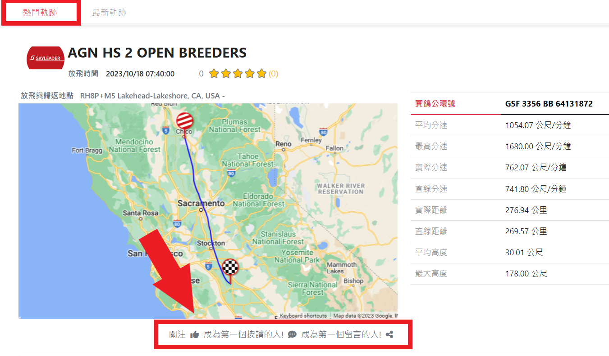
	
2. 點擊留言圖示，下方將顯示出讓您填寫留言的區塊，給予:star:數和填寫完畢後，請點擊張貼按鈕，即可上傳留言。

	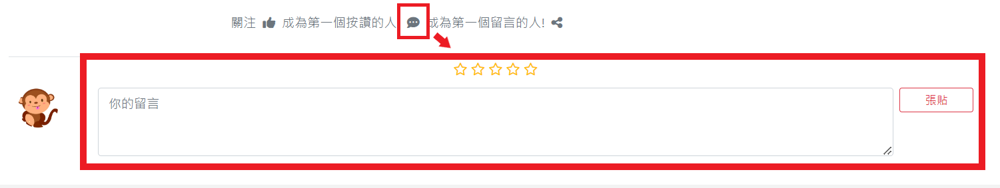

3. 當您點擊及旁的文字時，會跳出一個小視窗，您可以依您的喜好選擇按讚或留言，直接點擊圖示也可直接按讚。

	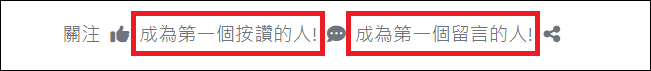

	:star:按讚的小視窗。
	
	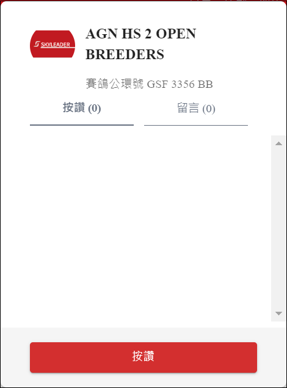</img>

	:star:留言的小視窗。
	
	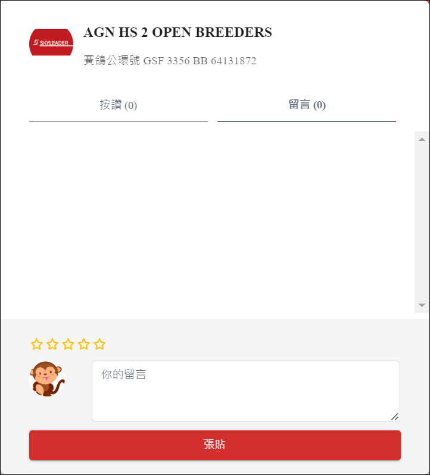</img>
	
4. 點擊分享圖示，可使分享此軌跡至Facebook、Twiter( X )，或複製連結分享， <strong>目前觀看分享連接，需要登入 skyleader3.0 帳號才可觀看 </strong>。

	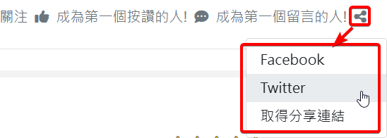

## 活動詳情頁

### 活動社交功能

1. 進入活動詳情頁後，需要先切換至"讀取"分頁，才可以使用完整活動社交功能。

	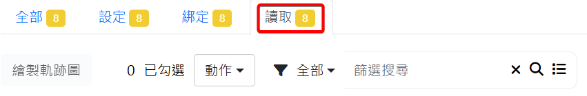

2. 活動社交功能在頁面右上最下方可選擇，右上方與最下方連動。

	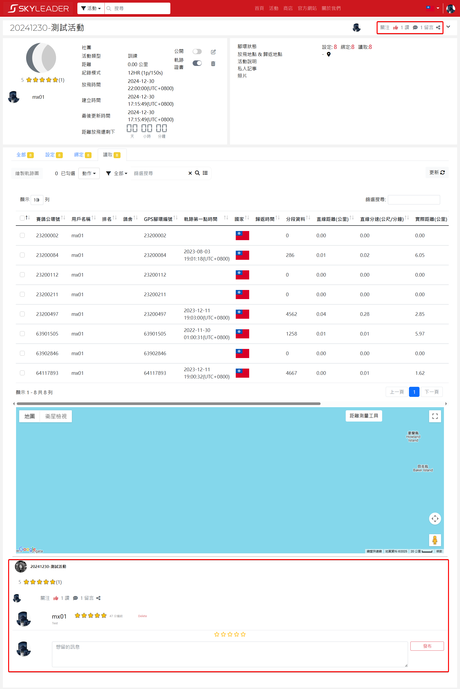</img>

3. 點擊頁面右上方留言圖示會自動移至最下方留言區，或直接手動移至最方下方留言區塊留言，給予:star:數和填寫完畢後，請點擊張貼按鈕，即可上傳留言。

	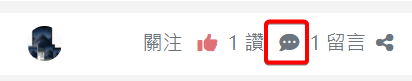

	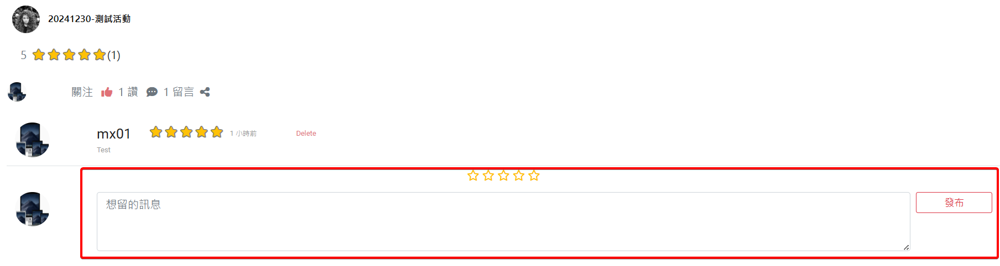
	
4. 當您在頁面右上方或最下方點擊及旁的文字時，會跳出一個小視窗，您可以依您的喜好做選擇按讚或留言，直接點擊圖示也可直接按讚。

	- 按讚小視窗
	
	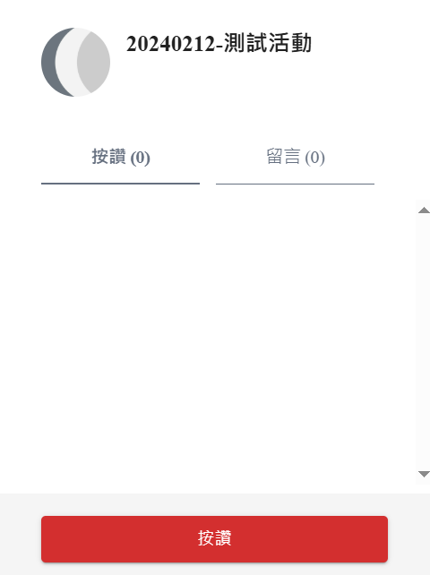</img>
	
	- 留言小視窗

	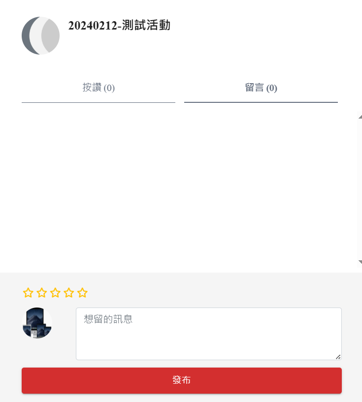</img>
	
5. 當您在頁面右上方或最下方點擊點擊分享圖示，可使分享此 **活動** 至Facebook、Twiter( X )，或複製連結分享， <strong>目前觀看分享連接，需要登入 skyleader3.0 帳號才可觀看 </strong>。

	
	
	
### 軌跡社交功能

**
 軌跡社交功能可在"活動詳情頁選擇單軌跡"或使用繪製軌跡功能"進入軌跡詳情"頁兩種方式 
**
- 活動詳情頁選擇單軌跡，在頁面最下方可使用軌跡社交功能

   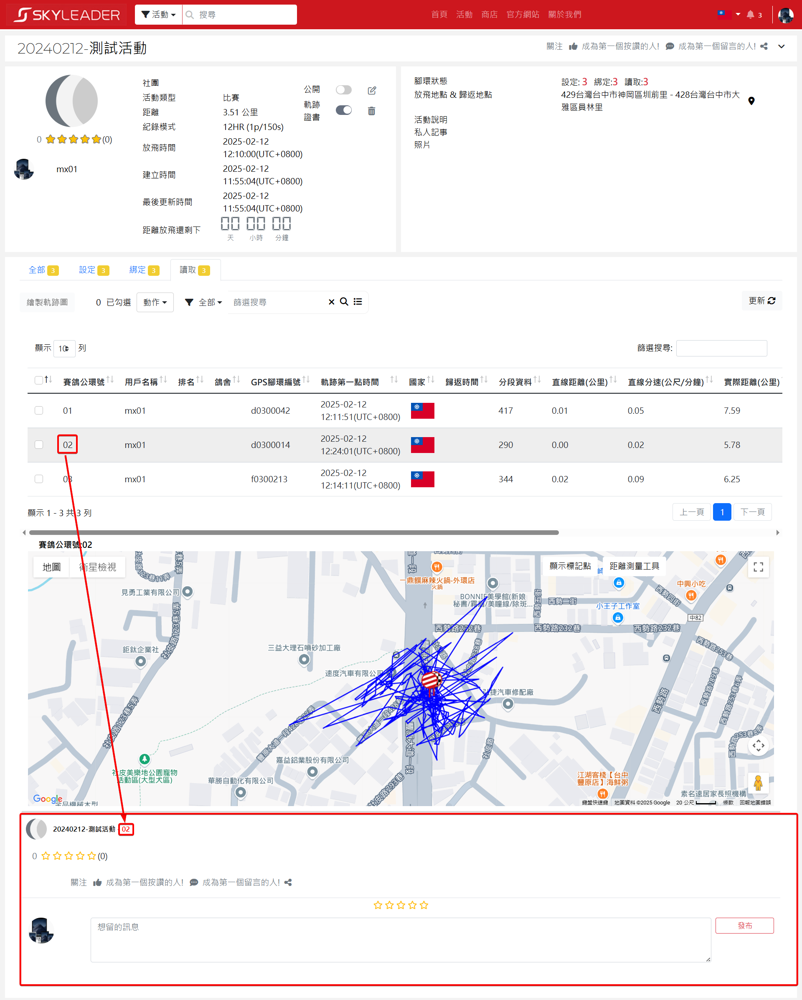</img>
   
- 軌跡詳情頁選擇單軌跡，最下方出現軌跡社交功能

	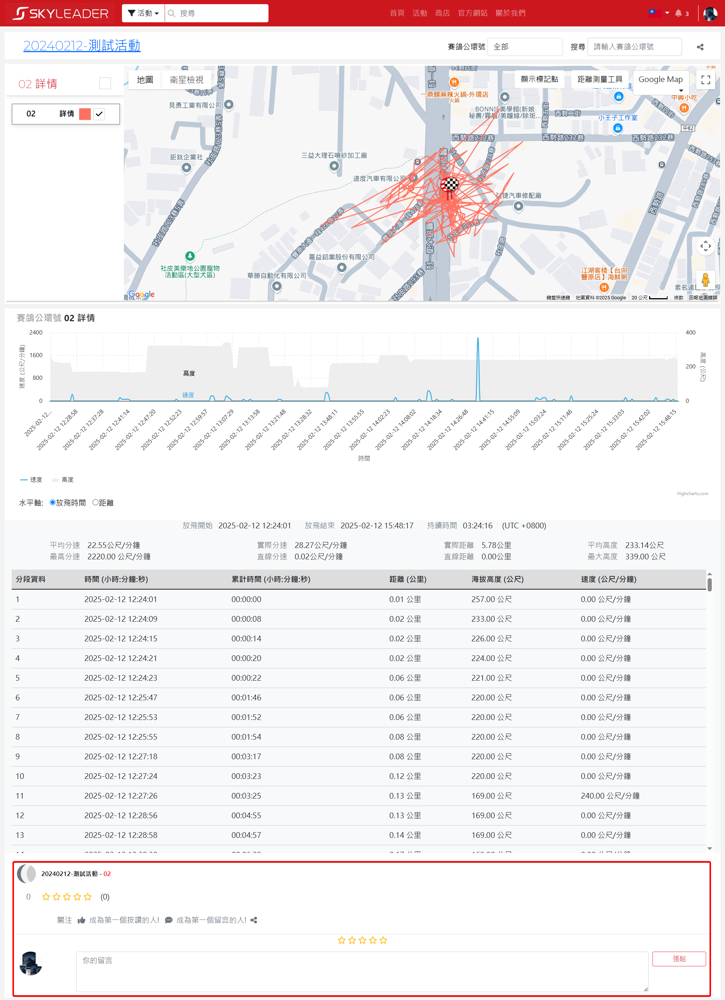</img>

- 使用方式與 [活動社交功能](#活動社交功能) 方式相同，可直接參考，不同地方是只針對 <strong>單軌跡 </strong>做按讚、留言、分享，而不是整個活動。

- 在活動詳情頁讀取分頁，選擇多軌跡繪製，進入軌跡詳情頁後，可在頁面右上方分享多軌跡，分享方式和 [活動社交功能](#活動社交功能)相同。

	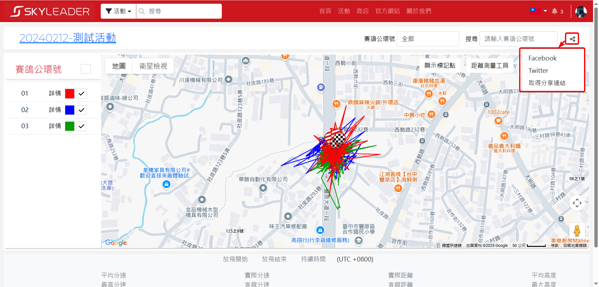</img>